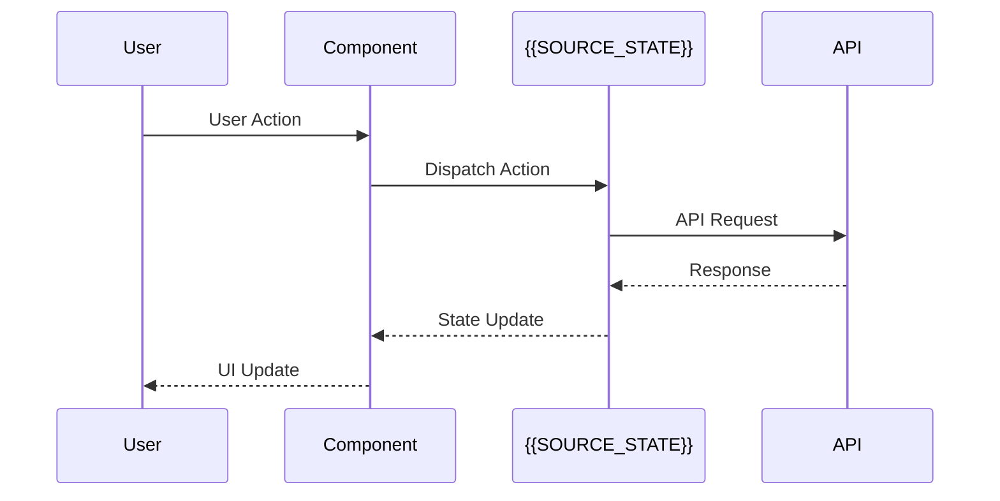
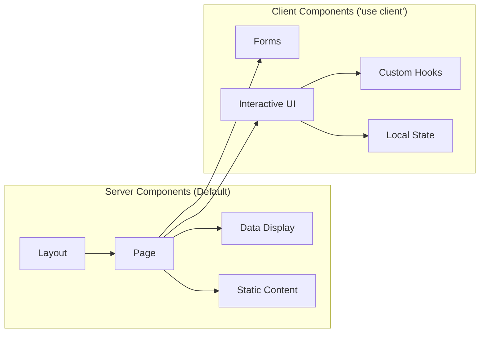

# Architecture Report

## jikime-adk-v2 Architecture Analysis

---

## 1. AS-IS Architecture

### 1.1 System Overview

```mermaid
graph TB
    subgraph "Client Layer"
        Browser[🌐 Browser]
    end

    subgraph "Frontend - {{SOURCE_FRAMEWORK}}"
        App[App Component]
        Router[{{SOURCE_ROUTER}}]
        Store[{{SOURCE_STATE}}]

        subgraph "Pages"
            P1[{{PAGE_1}}]
            P2[{{PAGE_2}}]
            P3[{{PAGE_3}}]
        end

        subgraph "Components"
            C1[{{COMPONENT_1}}]
            C2[{{COMPONENT_2}}]
            C3[{{COMPONENT_3}}]
        end
    end

    subgraph "External Services"
        API[Backend API]
        Auth[Auth Service]
        Storage[Storage]
    end

    Browser --> App
    App --> Router
    Router --> P1 & P2 & P3
    P1 & P2 & P3 --> C1 & C2 & C3
    App --> Store
    App --> API
    App --> Auth
    App --> Storage
```

### 1.2 Component Hierarchy

```mermaid
graph TD
    App[App.{{SOURCE_EXT}}]
    App --> Layout[Layout]
    App --> Router[Router]

    Layout --> Header[Header]
    Layout --> Sidebar[Sidebar]
    Layout --> Footer[Footer]

    Router --> Home[Home Page]
    Router --> Dashboard[Dashboard Page]
    Router --> Settings[Settings Page]

    Home --> Hero[Hero Section]
    Home --> Features[Features List]

    Dashboard --> Stats[Stats Cards]
    Dashboard --> Charts[Charts]
    Dashboard --> Table[Data Table]

    Settings --> Profile[Profile Form]
    Settings --> Preferences[Preferences]
```

### 1.3 Data Flow



### 1.4 Current Technology Stack

| Category | Technology | Version | Purpose |
|----------|------------|---------|---------|
| Framework | {{SOURCE_FRAMEWORK}} | {{SOURCE_VERSION}} | UI Framework |
| Router | {{SOURCE_ROUTER}} | {{SOURCE_ROUTER_VERSION}} | Navigation |
| State | {{SOURCE_STATE}} | {{SOURCE_STATE_VERSION}} | State Management |
| Styling | {{SOURCE_STYLING}} | {{SOURCE_STYLING_VERSION}} | CSS |
| Build | {{SOURCE_BUILD}} | {{SOURCE_BUILD_VERSION}} | Bundler |
| Testing | {{SOURCE_TESTING}} | {{SOURCE_TESTING_VERSION}} | Test Runner |

---

## 2. TO-BE Architecture

### 2.1 Target System Overview

```mermaid
graph TB
    subgraph "Client Layer"
        Browser[🌐 Browser]
    end

    subgraph "Next.js 16 App Router"
        subgraph "Server Components"
            RootLayout[Root Layout]
            ServerPages[Server Pages]
            DataFetching[Data Fetching]
        end

        subgraph "Client Components"
            Interactive[Interactive UI]
            ClientState[Client State]
        end

        subgraph "App Directory"
            AppLayout[app/layout.tsx]
            AppPage[app/page.tsx]
            AppRoutes[app/.../page.tsx]
        end
    end

    subgraph "Backend"
        API[API Routes]
        ServerActions[Server Actions]
    end

    subgraph "External"
        ExtAPI[External APIs]
        DB[(Database)]
    end

    Browser --> RootLayout
    RootLayout --> ServerPages
    ServerPages --> Interactive
    Interactive --> ClientState
    ServerPages --> DataFetching
    DataFetching --> API
    API --> ServerActions
    ServerActions --> ExtAPI
    ServerActions --> DB
```



### 2.2 App Router Structure

```
app/
├── layout.tsx              # Root Layout (Server)
├── page.tsx                # Home Page (Server)
├── loading.tsx             # Loading UI
├── error.tsx               # Error Boundary
├── not-found.tsx           # 404 Page
│
├── (auth)/                 # Auth Route Group
│   ├── login/
│   │   └── page.tsx
│   └── register/
│       └── page.tsx
│
├── dashboard/              # Dashboard Routes
│   ├── layout.tsx          # Dashboard Layout
│   ├── page.tsx            # Dashboard Home
│   ├── analytics/
│   │   └── page.tsx
│   └── settings/
│       └── page.tsx
│
├── api/                    # API Routes
│   └── [...]/
│       └── route.ts
│
└── _components/            # Shared Components
    ├── ui/                 # shadcn/ui components
    └── features/           # Feature components
```

### 2.3 Server vs Client Component Split



### 2.4 Target Technology Stack

| Category | Technology | Version | Purpose |
|----------|------------|---------|---------|
| Framework | Next.js | 16 | Full-stack Framework |
| Router | App Router | Built-in | File-based Routing |
| State | Zustand | Latest | Client State |
| Server State | React Query | Latest | Server State Cache |
| Styling | Tailwind CSS | 4.x | Utility CSS |
| UI Components | shadcn/ui | Latest | Accessible UI |
| Icons | lucide-react | Latest | Icon Library |
| Forms | react-hook-form | Latest | Form Handling |
| Validation | Zod | Latest | Schema Validation |

---

## 3. Technology Stack Comparison

### 3.1 Framework Comparison

| Feature | {{SOURCE_FRAMEWORK}} | Next.js 16 | Migration Impact |
|---------|---------------------|------------|------------------|
| Rendering | {{SOURCE_RENDERING}} | Server + Client | {{RENDERING_IMPACT}} |
| Routing | {{SOURCE_ROUTING_TYPE}} | File-based | {{ROUTING_IMPACT}} |
| Data Fetching | {{SOURCE_DATA_FETCH}} | Server Components | {{DATA_FETCH_IMPACT}} |
| SEO | {{SOURCE_SEO}} | Built-in SSR/SSG | {{SEO_IMPACT}} |
| Bundle Size | {{SOURCE_BUNDLE}} | Optimized | {{BUNDLE_IMPACT}} |
| DX | {{SOURCE_DX}} | Excellent | {{DX_IMPACT}} |

### 3.2 Feature Migration Map

| Current Feature | Target Implementation | Effort |
|-----------------|----------------------|--------|
| {{SOURCE_ROUTER}} | App Router | {{ROUTER_EFFORT}} |
| {{SOURCE_STATE}} | Zustand + React Query | {{STATE_EFFORT}} |
| {{SOURCE_STYLING}} | Tailwind CSS | {{STYLING_EFFORT}} |
| {{SOURCE_FORMS}} | react-hook-form + Zod | {{FORMS_EFFORT}} |
| {{SOURCE_API}} | API Routes / Server Actions | {{API_EFFORT}} |

---

## 4. Dependency Compatibility Matrix

### 4.1 Direct Replacements

| Current Package | Version | Next.js Equivalent | Version | Notes |
|-----------------|---------|-------------------|---------|-------|
| {{PKG_1}} | {{PKG_1_VER}} | {{PKG_1_ALT}} | {{PKG_1_ALT_VER}} | {{PKG_1_NOTE}} |
| {{PKG_2}} | {{PKG_2_VER}} | {{PKG_2_ALT}} | {{PKG_2_ALT_VER}} | {{PKG_2_NOTE}} |
| {{PKG_3}} | {{PKG_3_VER}} | {{PKG_3_ALT}} | {{PKG_3_ALT_VER}} | {{PKG_3_NOTE}} |

### 4.2 Packages Requiring Changes

| Current Package | Issue | Solution | Breaking Changes |
|-----------------|-------|----------|------------------|
| {{CHANGE_PKG_1}} | {{CHANGE_1_ISSUE}} | {{CHANGE_1_SOLUTION}} | {{CHANGE_1_BREAKING}} |
| {{CHANGE_PKG_2}} | {{CHANGE_2_ISSUE}} | {{CHANGE_2_SOLUTION}} | {{CHANGE_2_BREAKING}} |

### 4.3 Packages to Remove

| Package | Reason | Replacement |
|---------|--------|-------------|
| {{REMOVE_PKG_1}} | {{REMOVE_1_REASON}} | {{REMOVE_1_ALT}} |
| {{REMOVE_PKG_2}} | {{REMOVE_2_REASON}} | {{REMOVE_2_ALT}} |

---

## 5. Architecture Improvement Points

### 5.1 Performance Gains

| Area | Improvement | Impact |
|------|-------------|--------|
| Initial Load | Server Components reduce JS bundle | -{{JS_REDUCTION}}% bundle |
| Navigation | Prefetching + Streaming | {{NAV_IMPROVEMENT}} faster |
| Data Fetching | Server-side + Caching | -{{FETCH_REDUCTION}}% waterfalls |
| Images | next/image optimization | -{{IMAGE_REDUCTION}}% size |

### 5.2 Developer Experience

| Area | Before | After |
|------|--------|-------|
| Routing | Manual configuration | File-based (zero-config) |
| TypeScript | Optional setup | First-class support |
| Hot Reload | {{SOURCE_HMR}} | Fast Refresh |
| Error Handling | Manual | Built-in Error Boundaries |

### 5.3 Scalability Improvements

| Aspect | Current Limitation | Next.js Solution |
|--------|-------------------|------------------|
| SEO | {{CURRENT_SEO_LIMIT}} | SSR/SSG built-in |
| Performance | {{CURRENT_PERF_LIMIT}} | Edge Runtime support |
| Caching | {{CURRENT_CACHE_LIMIT}} | ISR + Data Cache |
| API | {{CURRENT_API_LIMIT}} | API Routes + Server Actions |

---

**Document**: 03_architecture_report.md
**Generated**: {{DATE}}
**Previous**: [← Feasibility Report](./02_feasibility_report.md)
**Next**: [Complexity Matrix →](./04_complexity_matrix.md)
