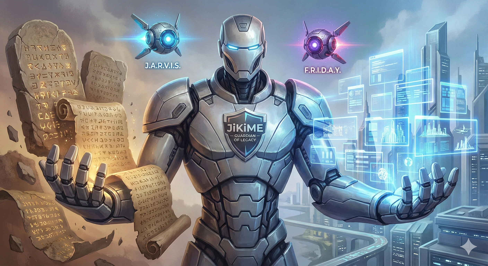

<p align="center">
  <a href="./README.md">English</a> |
  <a href="./README.ko.md">한국어</a>
</p>

<p align="center">
  
</p>

# JiKiME-ADK: Preserve Legacy Value, Open the Path to Modernization

**AI-Powered Agentic Development Kit for Legacy Modernization**

<p align="center">
  <a href="https://go.dev/"></a>
  <a href="./LICENSE"></a>
  <a href="https://github.com/jikime/jikime-adk/releases"></a>
</p>

> **"Preserve the essence and value embedded in legacy code while safely transforming it into modernized code."**

---

## What is JiKiME-ADK?

Faced with the massive challenge of modernizing legacy code from over 16,000 websites, I found myself in deep contemplation. This vast amount of code wasn't simply outdated relics—it represented the accumulated business value built over many years. How could I connect these precious assets to the future most safely and efficiently? **JiKiME-ADK** was born from that contemplation.

### 'JiKiME (지키미)': Preserving Legacy While Guarding the Future

There's a special reason for naming this project **JiKiME**. In Korean, it reads as **'지키미' (Jikimi)**, meaning "guardian" or "protector." This name embodies our sincere commitment: **"To preserve the essence and value embedded in legacy code while safely transforming it into modernized code, thereby guarding the entire system."** Rather than simply rewriting code, we pledge to serve as a steadfast guardian connecting the past to the future.

### MoAI-ADK: Our Guiding Compass, and a New Leap Forward

At the beginning of this journey, **[MoAI-ADK](https://github.com/modu-ai/moai-adk)** by Goos.Kim provided clear direction. Deeply inspired by Goos.Kim's profound insights on agentic workflows, I analyzed MoAI-ADK's structure and flow extensively.

Building upon its solid philosophical foundation, I developed a new ADK specialized for migration using **Golang** as the primary language. Thanks to MoAI-ADK's excellent foundation, I was able to complete unique features tailored to the B2B market's urgent need for 'legacy modernization.' This is not a mere copy, but a new flower blooming from the nourishment of a senior developer's valuable assets.

### J.A.R.V.I.S. and F.R.I.D.A.Y.: Dual Orchestration

For efficient migration, I adopted a **'Dual Orchestration'** system inspired by Iron Man's assistants.

| Orchestrator | Role | Description |
|---|---|---|
| **J.A.R.V.I.S.** | Development | Smart assistant for new architecture design and standard code generation |
| **F.R.I.D.A.Y.** | Migration | Migration specialist analyzing complex legacy code and converting to modern structures |

Just as Tony Stark utilizes situation-optimized assistants in the movies, I appointed these two to maximize expertise in both development and migration domains. Beyond being fun, this is a practical choice to clearly distinguish each agent's role and improve processing efficiency.

> Details: [J.A.R.V.I.S. Documentation](./docs/en/jarvis.md) | [F.R.I.D.A.Y. Documentation](./docs/en/friday.md)

### Technology Fusion and the Journey Toward Completion

I've further enhanced JiKiME's capabilities by referencing the agent, command, and hook structures from the recently released **everything-claude-code**. By absorbing the strengths of proven open-source projects and adding migration-specific Skills, I'm currently conducting real-world tests against various legacy cases.

---

## Key Features

| Feature | Description | Documentation |
|---------|-------------|---------------|
| **POC-First Workflow** | Phase-based greenfield development: Make It Work → Refactor → Test → Quality → PR | [POC-First Guide](./docs/en/poc-first.md) |
| **SPEC-First DDD** | Behavior-preserving development with ANALYZE-PRESERVE-IMPROVE cycle | [DDD Docs](./docs/en/tdd-ddd.md) |
| **57 Specialized Agents** | Auto-delegation across Manager 12, Specialist 37, Designer 1, Orchestration 3, Builder 4 agents | [Agent Catalog](./docs/en/agents.md) |
| **Agent Teams** | Parallel team-based multi-agent orchestration (experimental) | [Agent Teams](./docs/en/agents-team.md) |
| **Legacy Migration** | Auto-conversion from Vue.js, React CRA, Angular, etc. → Next.js 16 | [Migration Guide](./docs/en/migration.md) |
| **Smart Rebuild** | Screenshot + source analysis based legacy site reconstruction | [Smart Rebuild Guide](./docs/en/smart-rebuild.md) |
| **Structured Task Format** | Do/Files/Done-when/Verify/Commit 5-field task structure with quality checkpoints | [Task Format Guide](./docs/en/task-format.md) |
| **PR Lifecycle Automation** | Automated PR creation, CI monitoring, review resolution, and merge | [PR Lifecycle Guide](./docs/en/pr-lifecycle.md) |
| **73 Skill System** | Progressive Disclosure based knowledge loading | [Skills Catalog](./docs/en/skills-catalog.md) |
| **Quality Assurance** | TRUST 5 Framework + LSP Quality Gates | [Quality Guide](./docs/en/rules.md) |
| **LLM Provider Router** | Switch between OpenAI, Gemini, GLM, Ollama | [Router Docs](./docs/en/provider-router.md) |

---

## Installation

### Method 1: Install Script (Recommended)

```bash
curl -fsSL https://jikime.github.io/jikime-adk/install.sh | bash
```

### Method 2: go install

```bash
go install github.com/jikime/jikime-adk@latest
```

### Method 3: Manual Download

Download the binary for your platform from [GitHub Releases](https://github.com/jikime/jikime-adk/releases).

---

## Getting Started

### 1. Initialize Project

```bash
jikime-adk init
```

### 2. Use with Claude Code

```bash
# Project analysis and documentation generation
/jikime:0-project

# SPEC definition (development plan)
/jikime:1-plan "User authentication system"

# SPEC implementation (DDD cycle)
/jikime:2-run SPEC-AUTH-001

# Document sync & completion
/jikime:3-sync SPEC-AUTH-001
```

---

## Command Summary

### Claude Code Slash Commands

| Type | Command | Description |
|------|---------|-------------|
| **Workflow** | `/jikime:0-project` ~ `/jikime:3-sync` | Core development workflow |
| **J.A.R.V.I.S.** | `/jikime:jarvis`, `/jikime:test`, `/jikime:loop`, `/jikime:poc`, `/jikime:pr-lifecycle` | Autonomous development orchestration |
| **F.R.I.D.A.Y.** | `/jikime:friday`, `/jikime:migrate-*` | Autonomous migration |
| **Utility** | `/jikime:build-fix`, `/jikime:verify --browser-only` | Build/runtime error fixing |

> Full command list: [Command Reference](./docs/en/commands.md)

### CLI Commands

| Command | Description |
|---------|-------------|
| `jikime init` | Install templates to project |
| `jikime update` | Auto-update binary |
| `jikime doctor` | System diagnostics |
| `jikime router switch <provider>` | Switch LLM provider |
| `jikime worktree new <branch>` | Create Git Worktree |
| `jikime skill list` | List skills |

> CLI details: [CLI Documentation](./docs/en/commands.md#cli-commands)

---

## Agent Catalog

JiKiME-ADK provides **26 specialized agents**:

| Type | Count | Representative Agents |
|------|-------|----------------------|
| **Manager** | 8 | manager-spec, manager-ddd, manager-quality |
| **Specialist** | 14 | backend, frontend, security-auditor, optimizer |
| **Builder** | 4 | agent-builder, command-builder, skill-builder |

> Full agent list: [Agent Catalog](./docs/en/agents.md)

---

## Development Methodology: DDD

All development applies the **ANALYZE-PRESERVE-IMPROVE** cycle:

```
ANALYZE   →  Understand current behavior
    ↓
PRESERVE  →  Preserve behavior with characterization tests
    ↓
IMPROVE   →  Change with confidence → (repeat)
```

> Details: [DDD Methodology Documentation](./docs/en/tdd-ddd.md)

---

## Documentation

| Document | Description |
|----------|-------------|
| [Agent Catalog](./docs/en/agents.md) | 26 agent detailed roles |
| [Agent Teams](./docs/en/agents-team.md) | Parallel team-based multi-agent orchestration |
| [Command Reference](./docs/en/commands.md) | Full slash command and CLI list |
| [Skills Catalog](./docs/en/skills-catalog.md) | 60 skill classifications and descriptions |
| [Migration Guide](./docs/en/migration.md) | F.R.I.D.A.Y. migration workflow |
| [Smart Rebuild Guide](./docs/en/smart-rebuild.md) | Screenshot-based legacy site reconstruction |
| [Smart Rebuild Flow](./docs/en/smart-rebuild-flow.md) | Smart Rebuild full workflow diagram |
| [POC-First Workflow](./docs/en/poc-first.md) | Phase-based greenfield development guide |
| [Structured Task Format](./docs/en/task-format.md) | 5-field task structure with quality checkpoints |
| [PR Lifecycle](./docs/en/pr-lifecycle.md) | Automated PR creation to merge workflow |
| [DDD Methodology](./docs/en/tdd-ddd.md) | ANALYZE-PRESERVE-IMPROVE cycle |
| [Quality Rules](./docs/en/rules.md) | TRUST 5, coding style, security guide |
| [Worktree Management](./docs/en/worktree.md) | Git Worktree parallel development |
| [LLM Router](./docs/en/provider-router.md) | External LLM provider integration |
| [Hooks System](./docs/en/hooks.md) | Claude Code hook configuration |
| [Ralph Loop](./docs/en/ralph-loop.md) | LSP/AST-grep feedback loop |
| [Statusline](./docs/en/statusline.md) | Claude Code statusline customization |
| [Codemap](./docs/en/codemap.md) | AST-based architecture map |
| [Site-Flow Integration](./docs/en/site-flow.md) | Project management and progress tracking |

---

## Project Structure

```
jikime-adk/
├── cmd/                    # CLI command implementations
│   ├── hookscmd/           # Claude Code hooks
│   └── mcpcmd/             # MCP server
├── internal/               # Internal packages
│   └── router/             # LLM provider router
├── templates/              # Embedded project templates
│   ├── .claude/            # Agents, commands, skills
│   └── .jikime/            # Configuration files
├── docs/                   # Documentation
│   ├── en/                 # English documentation
│   └── ko/                 # Korean documentation
└── scripts/                # Automation scripts
```

---

## Acknowledgments

JiKiME-ADK owes its current form to the direction provided by MoAI-ADK. While JiKiME will continue to evolve with its own unique logic and code, the inspiration from Goos.Kim that lies at its roots will endure. I extend my deepest gratitude to Goos.Kim for showing us the way.

- **[MoAI-ADK](https://github.com/modu-ai/moai-adk)** - Goos.Kim's agentic workflow philosophy and structural inspiration
- **[everything-claude-code](https://github.com/anthropics/anthropic-cookbook)** - Agent, command, hook structure reference

---

## Our Promise

I will continue to share JiKiME-ADK's development journey. Through countless trials and errors, I will prove this tool can be the answer for legacy migration. And when that fruition comes, I will gladly share it so it can help more developers.

**Please watch JiKiME's journey as it guards legacy and opens the future.**

---

## Links

- [GitHub Repository](https://github.com/jikime/jikime-adk)
- [Releases](https://github.com/jikime/jikime-adk/releases)
- [Install Script](https://jikime.github.io/jikime-adk/install.sh)

---

## License

Copyleft License (COPYLEFT-3.0) - See [LICENSE](./LICENSE) for details.
