# Mermaid Diagram Guide

Mermaid 11+ 다이어그램 작성을 위한 간결한 가이드.

## Quick Reference

| 다이어그램 | 용도 |
|-----------|------|
| **Flowchart** | 프로세스, 결정 트리 |
| **Sequence** | 상호작용, API 흐름 |
| **Class** | 클래스 관계, 구조 |
| **ER** | 데이터베이스 스키마 |
| **State** | 상태 머신 |
| **C4** | 시스템 아키텍처 |

## Flowchart

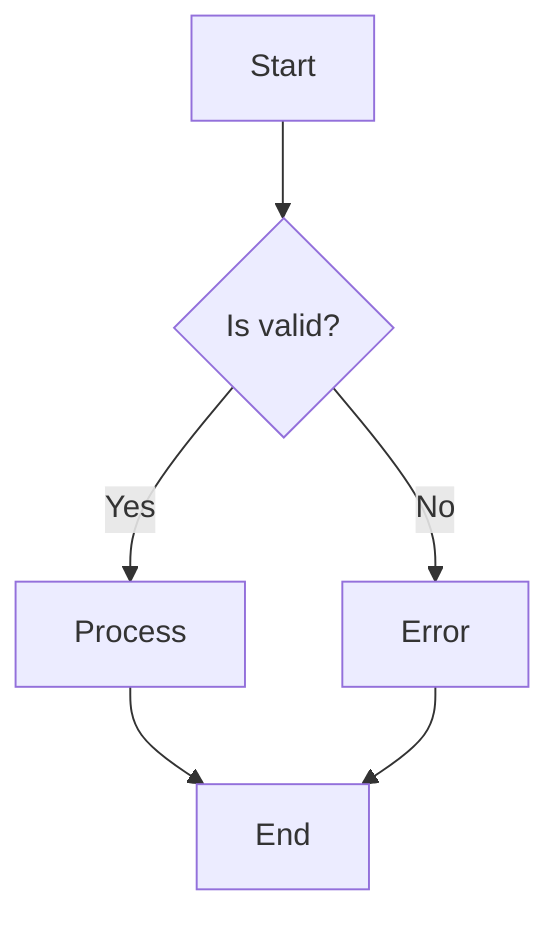

### 노드 형태

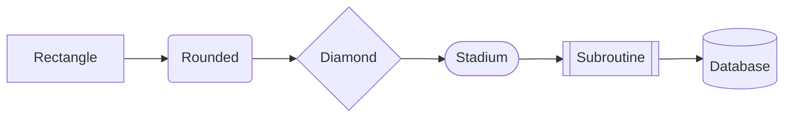

### 서브그래프

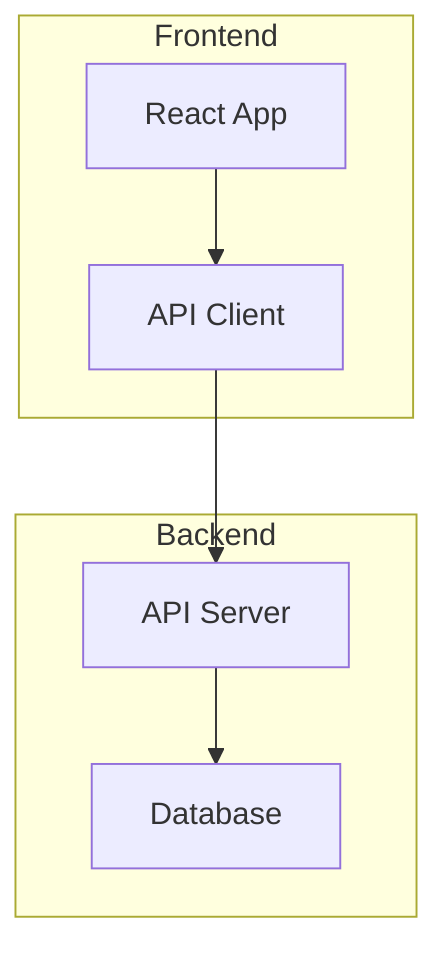

## Sequence Diagram

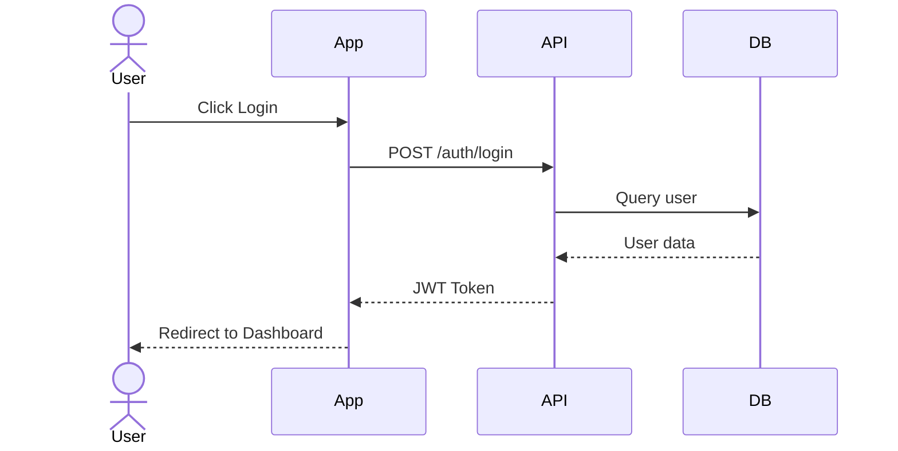

### 조건분기

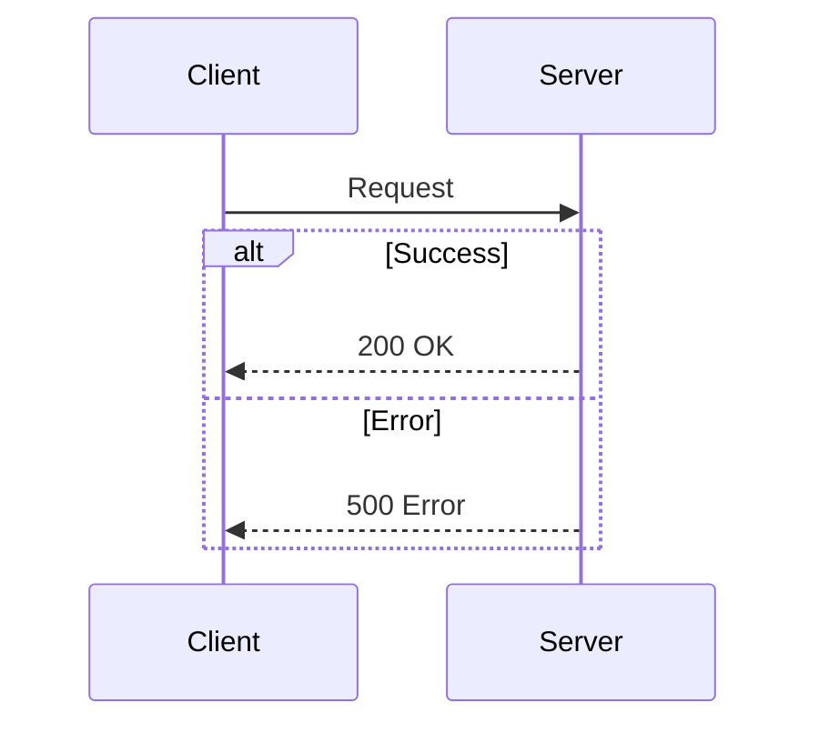

## Class Diagram

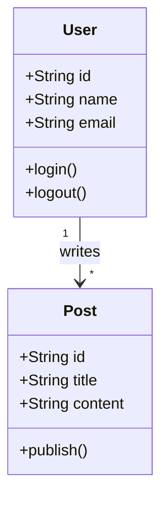

## ER Diagram

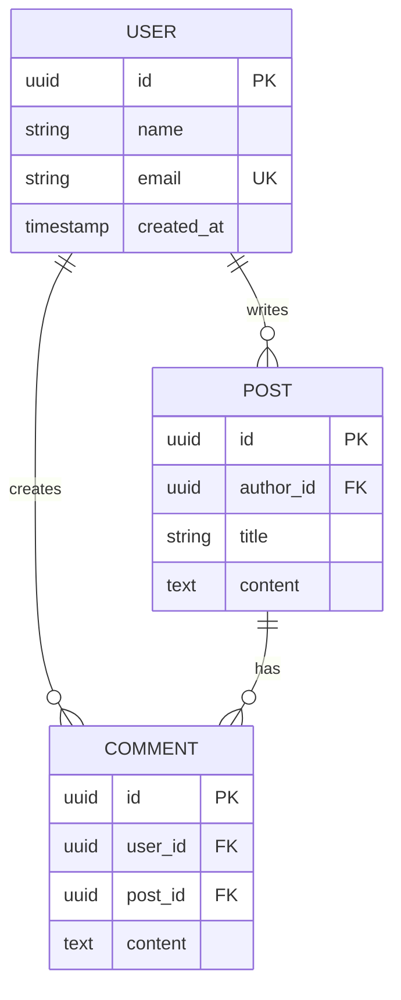

## State Diagram

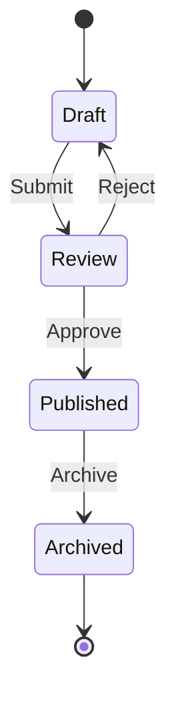

## C4 Architecture

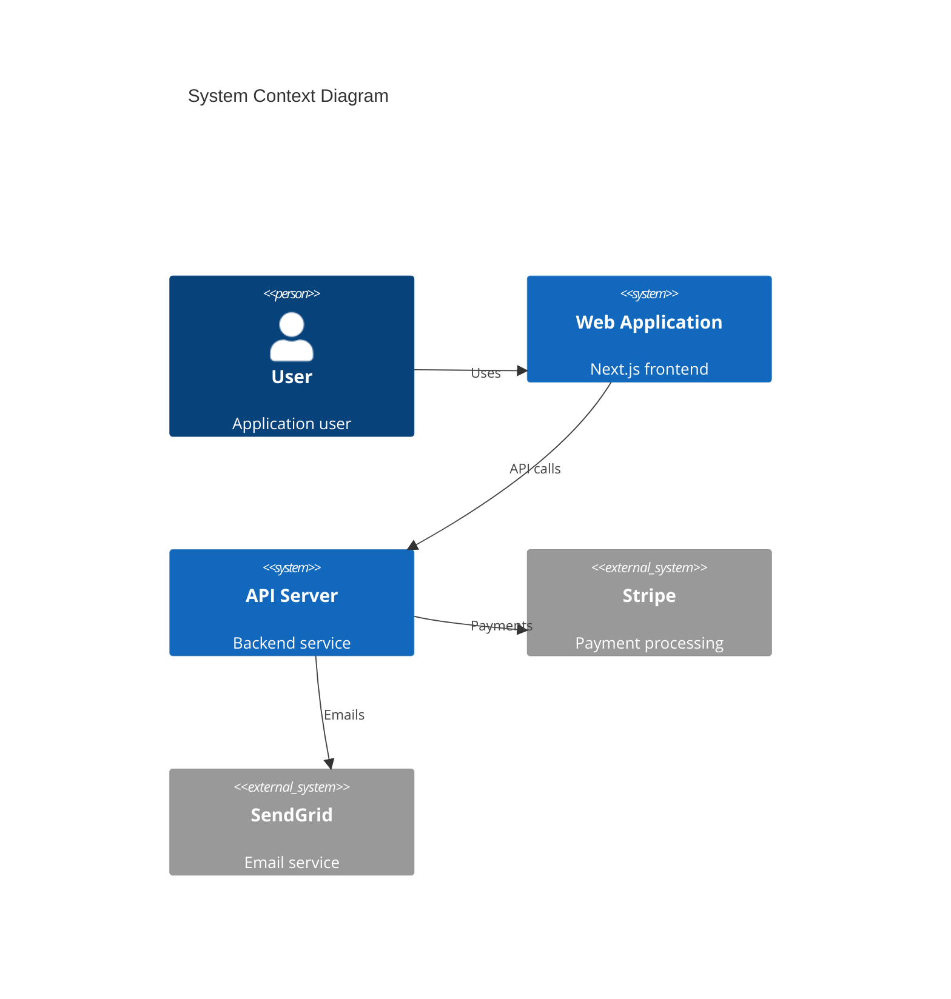

## Gantt Chart

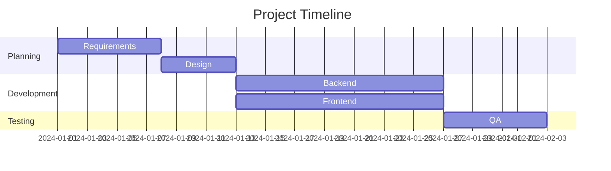

## Pie Chart

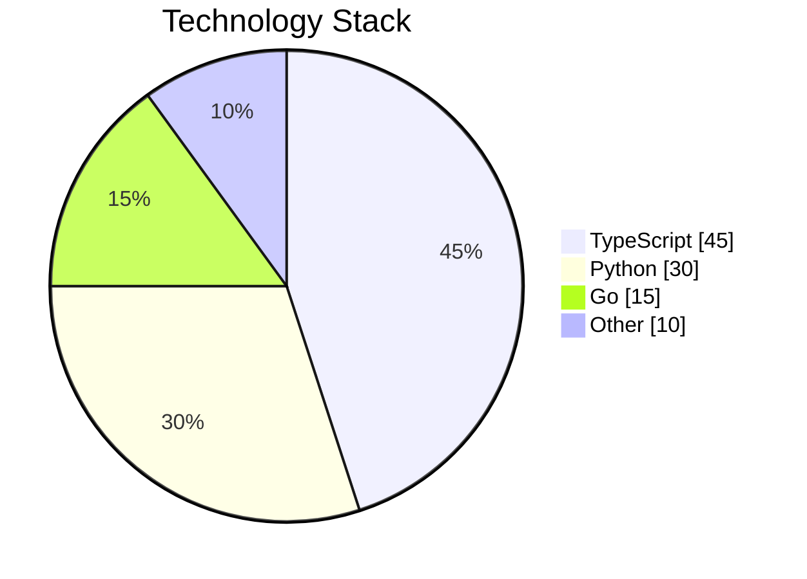

## Git Graph

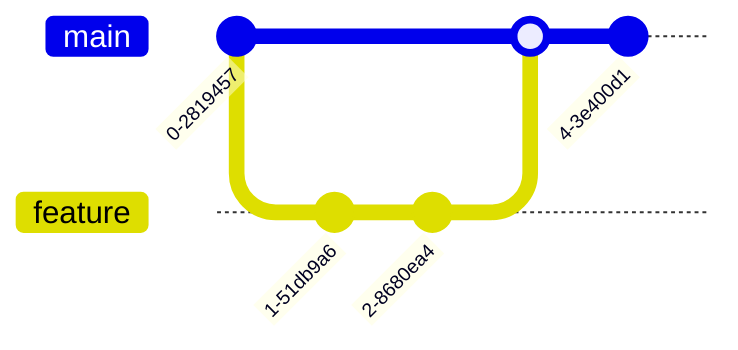

## Best Practices

- **단순하게**: 노드 20-30개 이하로 유지
- **방향성**: TD(위→아래) 또는 LR(왼→오) 일관성
- **레이블**: 모든 연결에 명확한 레이블
- **색상**: 필요시만 스타일 적용
- **서브그래프**: 관련 노드 그룹화

## 문서 내 사용

````markdown
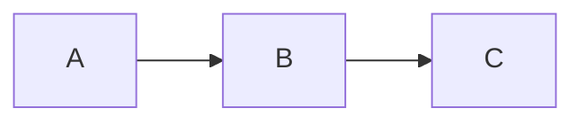
````

---

Last Updated: 2026-01-21
Version: 2.0.0
