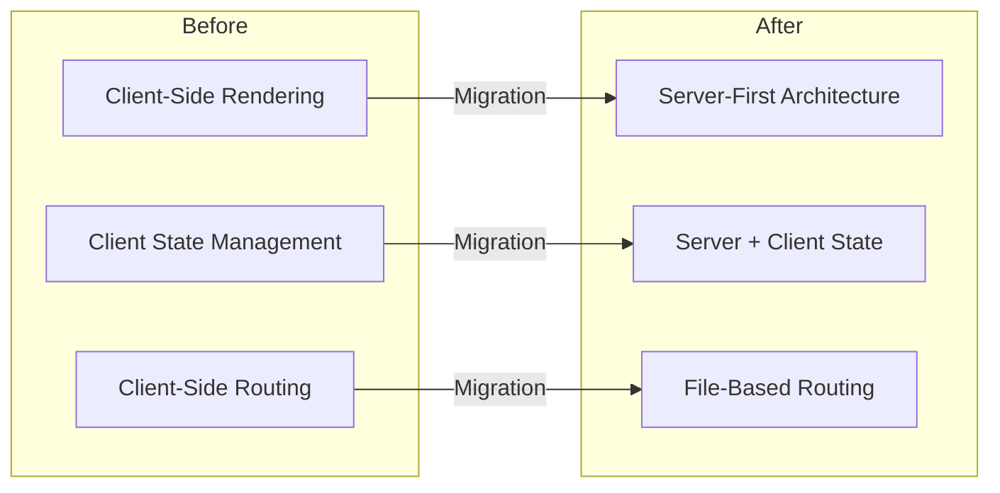
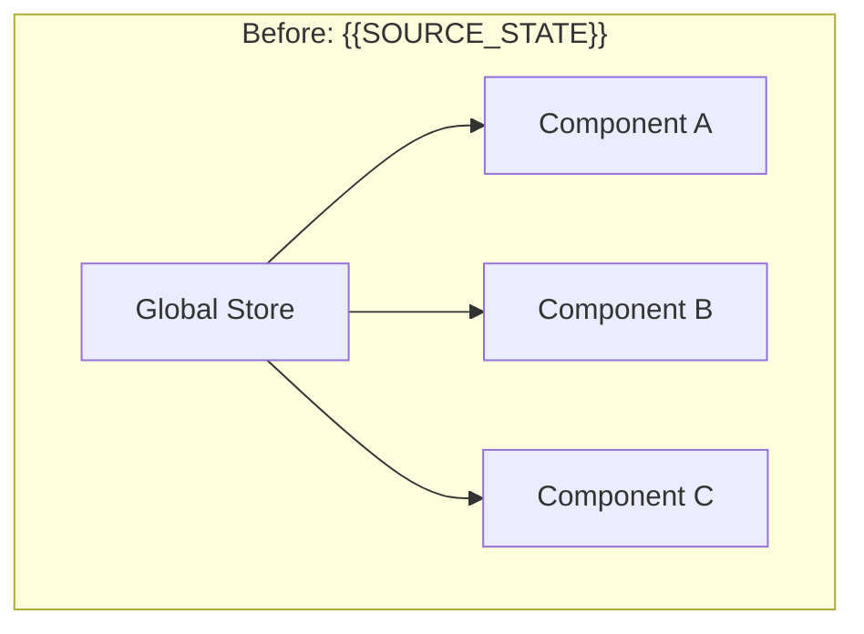
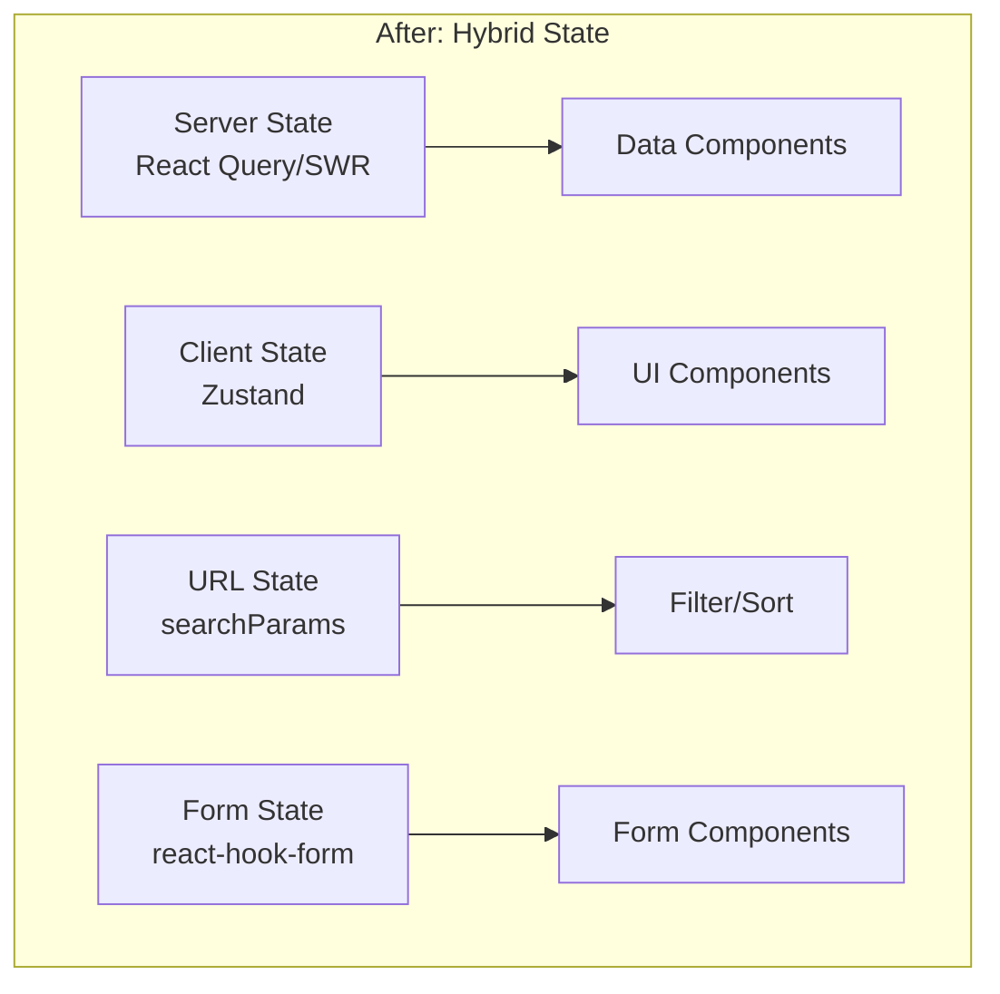
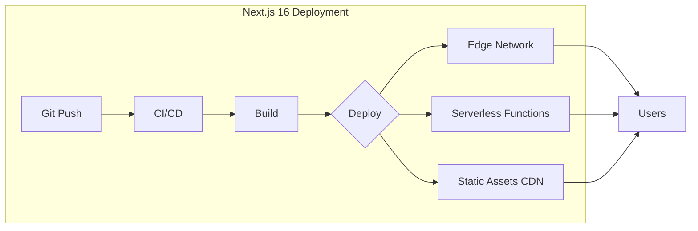

# Architecture Evolution Report

## {{PROJECT_NAME}} 아키텍처 진화 보고서

---

## 1. 아키텍처 변화 개요

### 1.1 기술 스택 전환

| 영역 | Before (AS-IS) | After (TO-BE) |
|------|----------------|---------------|
| **Framework** | {{SOURCE_FRAMEWORK}} | Next.js 16 (App Router) |
| **Language** | {{SOURCE_LANGUAGE}} | TypeScript 5.x |
| **Rendering** | {{SOURCE_RENDERING}} | Hybrid (SSR + SSG + CSR) |
| **Routing** | {{SOURCE_ROUTING}} | File-based App Router |
| **State** | {{SOURCE_STATE}} | Zustand + Server State |
| **Styling** | {{SOURCE_STYLING}} | Tailwind CSS 4.x |
| **Components** | {{SOURCE_COMPONENTS}} | shadcn/ui |

### 1.2 아키텍처 패러다임 전환



---

## 2. 렌더링 전략 비교

### 2.1 렌더링 방식 변화

| 페이지 유형 | Before | After | 이점 |
|------------|--------|-------|------|
| **홈페이지** | {{HOME_RENDER_BEFORE}} | Static (SSG) | 빠른 TTFB, 캐싱 |
| **제품 목록** | {{LIST_RENDER_BEFORE}} | ISR (60s) | 실시간성 + 성능 |
| **제품 상세** | {{DETAIL_RENDER_BEFORE}} | Dynamic (SSR) | SEO + 최신 데이터 |
| **대시보드** | {{DASH_RENDER_BEFORE}} | Client (CSR) | 인터랙티브 |
| **설정** | {{SETTINGS_RENDER_BEFORE}} | Server Component | 번들 크기 감소 |

### 2.2 Server Components 적용

```
Server Components 적용 현황
────────────────────────────────────────────────────────
Total Components: {{TOTAL_COMPONENTS}}개

Server Components: {{SERVER_COMPONENTS}}개 ({{SC_PERCENTAGE}}%)
├── 데이터 페칭
├── 정적 UI
└── 인증 필요 없는 영역

Client Components: {{CLIENT_COMPONENTS}}개 ({{CC_PERCENTAGE}}%)
├── 인터랙티브 UI
├── 브라우저 API 사용
└── 실시간 업데이트

JS 번들 감소: {{JS_BUNDLE_REDUCTION}}
────────────────────────────────────────────────────────
```

---

## 3. 디렉토리 구조 변화

### 3.1 Before: 레거시 구조

```
{{SOURCE_FRAMEWORK}} Project Structure
────────────────────────────────────
{{SOURCE_STRUCTURE}}
```

### 3.2 After: Next.js App Router 구조

```
Next.js 16 App Router Structure
────────────────────────────────────
src/
├── app/                          # App Router
│   ├── layout.tsx               # Root Layout
│   ├── page.tsx                 # Home Page
│   ├── loading.tsx              # Loading UI
│   ├── error.tsx                # Error Boundary
│   ├── not-found.tsx            # 404 Page
│   ├── (auth)/                  # Auth Route Group
│   │   ├── login/
│   │   └── register/
│   ├── (dashboard)/             # Dashboard Route Group
│   │   ├── layout.tsx
│   │   └── [slug]/
│   └── api/                     # API Routes
│       └── [...]/
├── components/
│   ├── ui/                      # shadcn/ui components
│   └── features/                # Feature components
├── lib/
│   ├── utils.ts                 # Utility functions
│   └── api/                     # API clients
├── stores/                      # Zustand stores
├── types/                       # TypeScript types
└── styles/
    └── globals.css              # Tailwind CSS
```

---

## 4. 라우팅 아키텍처 변화

### 4.1 라우팅 비교

| 기능 | Before | After |
|------|--------|-------|
| **라우팅 방식** | {{ROUTING_TYPE_BEFORE}} | File-based (App Router) |
| **동적 라우트** | {{DYNAMIC_BEFORE}} | `[param]/page.tsx` |
| **중첩 레이아웃** | {{NESTED_BEFORE}} | Native 지원 |
| **병렬 라우트** | ❌ | `@slot` 지원 |
| **인터셉팅** | ❌ | `(.)`, `(..)` 지원 |
| **미들웨어** | {{MIDDLEWARE_BEFORE}} | `middleware.ts` |

### 4.2 라우트 매핑

| 기존 경로 | 새 경로 | 렌더링 |
|----------|---------|--------|
| {{ROUTE_1_BEFORE}} | {{ROUTE_1_AFTER}} | {{ROUTE_1_RENDER}} |
| {{ROUTE_2_BEFORE}} | {{ROUTE_2_AFTER}} | {{ROUTE_2_RENDER}} |
| {{ROUTE_3_BEFORE}} | {{ROUTE_3_AFTER}} | {{ROUTE_3_RENDER}} |
| {{ROUTE_4_BEFORE}} | {{ROUTE_4_AFTER}} | {{ROUTE_4_RENDER}} |
| {{ROUTE_5_BEFORE}} | {{ROUTE_5_AFTER}} | {{ROUTE_5_RENDER}} |

---

## 5. 상태 관리 진화

### 5.1 상태 관리 전략 변화





### 5.2 상태 유형별 관리

| 상태 유형 | Before | After | 이점 |
|----------|--------|-------|------|
| **서버 데이터** | {{SERVER_STATE_BEFORE}} | React Query | 캐싱, 재검증 |
| **UI 상태** | {{UI_STATE_BEFORE}} | Zustand | 간단, 가벼움 |
| **폼 상태** | {{FORM_STATE_BEFORE}} | react-hook-form + Zod | 성능, 검증 |
| **URL 상태** | {{URL_STATE_BEFORE}} | nuqs (searchParams) | 공유 가능, 북마크 |

---

## 6. 데이터 페칭 패턴 변화

### 6.1 페칭 전략 비교

| 패턴 | Before | After |
|------|--------|-------|
| **서버 데이터** | {{FETCH_SERVER_BEFORE}} | Server Components + fetch |
| **클라이언트 데이터** | {{FETCH_CLIENT_BEFORE}} | React Query / SWR |
| **실시간 데이터** | {{FETCH_REALTIME_BEFORE}} | Server-Sent Events |
| **Form Actions** | {{FETCH_FORM_BEFORE}} | Server Actions |

### 6.2 데이터 페칭 예시

```typescript
// Before: Client-side fetching
useEffect(() => {
  fetch('/api/users')
    .then(res => res.json())
    .then(setUsers)
}, [])

// After: Server Component fetching
async function UsersPage() {
  const users = await fetch('https://api.example.com/users', {
    next: { revalidate: 60 } // ISR: 60초마다 재검증
  }).then(res => res.json())

  return <UserList users={users} />
}
```

---

## 7. API 아키텍처 변화

### 7.1 API 설계 비교

| 영역 | Before | After |
|------|--------|-------|
| **API 스타일** | {{API_STYLE_BEFORE}} | REST + Server Actions |
| **인증** | {{API_AUTH_BEFORE}} | Middleware + JWT |
| **검증** | {{API_VALIDATION_BEFORE}} | Zod Schema |
| **에러 처리** | {{API_ERROR_BEFORE}} | Typed Error Responses |

### 7.2 API Route 구조

```
app/api/
├── auth/
│   ├── login/route.ts          # POST /api/auth/login
│   ├── logout/route.ts         # POST /api/auth/logout
│   └── me/route.ts             # GET /api/auth/me
├── users/
│   ├── route.ts                # GET, POST /api/users
│   └── [id]/route.ts           # GET, PUT, DELETE /api/users/:id
└── products/
    ├── route.ts
    └── [id]/route.ts
```

---

## 8. 컴포넌트 아키텍처 변화

### 8.1 컴포넌트 분류

| 카테고리 | 설명 | 예시 |
|----------|------|------|
| **UI Components** | 재사용 가능한 UI 요소 | Button, Card, Modal |
| **Feature Components** | 비즈니스 로직 포함 | UserProfile, ProductCard |
| **Layout Components** | 페이지 레이아웃 | Header, Sidebar, Footer |
| **Page Components** | 라우트별 페이지 | app/*/page.tsx |

### 8.2 컴포넌트 설계 원칙

```
컴포넌트 설계 원칙 (After)
────────────────────────────────────────────────────────
1. Server-First: 기본적으로 Server Component
2. Client Islands: 필요한 부분만 Client Component
3. Composition: 작은 컴포넌트 조합
4. Colocation: 관련 파일 같은 폴더에
5. Type Safety: Props는 모두 TypeScript interface
────────────────────────────────────────────────────────
```

---

## 9. 인프라/배포 아키텍처

### 9.1 배포 환경 비교

| 항목 | Before | After |
|------|--------|-------|
| **호스팅** | {{HOSTING_BEFORE}} | {{HOSTING_AFTER}} |
| **CDN** | {{CDN_BEFORE}} | {{CDN_AFTER}} |
| **빌드** | {{BUILD_BEFORE}} | Turbopack |
| **CI/CD** | {{CICD_BEFORE}} | {{CICD_AFTER}} |

### 9.2 배포 아키텍처



---

## 10. 아키텍처 품질 개선

### 10.1 품질 지표 비교

| 지표 | Before | After | 개선율 |
|------|--------|-------|--------|
| **확장성** | {{SCALABILITY_BEFORE}} | {{SCALABILITY_AFTER}} | ↑{{SCALABILITY_IMPROVEMENT}}% |
| **유지보수성** | {{MAINTAINABILITY_BEFORE}} | {{MAINTAINABILITY_AFTER}} | ↑{{MAINTAINABILITY_IMPROVEMENT}}% |
| **테스트 용이성** | {{TESTABILITY_BEFORE}} | {{TESTABILITY_AFTER}} | ↑{{TESTABILITY_IMPROVEMENT}}% |
| **배포 용이성** | {{DEPLOYABILITY_BEFORE}} | {{DEPLOYABILITY_AFTER}} | ↑{{DEPLOYABILITY_IMPROVEMENT}}% |

### 10.2 아키텍처 장점

```
Next.js 16 아키텍처 장점
────────────────────────────────────────────────────────
✅ Server-First      : 클라이언트 번들 최소화
✅ Hybrid Rendering  : 페이지별 최적 렌더링 선택
✅ Type Safety       : End-to-End 타입 안전성
✅ Edge Ready        : 글로벌 저지연 배포
✅ Built-in Features : 이미지, 폰트, SEO 최적화 내장
✅ DX                : 빠른 개발 서버, HMR
────────────────────────────────────────────────────────
```

---

## 11. 권장 사항

### 11.1 향후 개선 방향

- [ ] {{ARCH_RECOMMENDATION_1}}
- [ ] {{ARCH_RECOMMENDATION_2}}
- [ ] {{ARCH_RECOMMENDATION_3}}

### 11.2 확장 계획

- [ ] 마이크로프론트엔드 도입 검토
- [ ] 서버리스 아키텍처 확장
- [ ] 글로벌 CDN 최적화

---

**Document**: 05_architecture_evolution.md (Post-Migration)
**Generated**: {{DATE}}
**Previous**: [← Code Quality Report](./04_code_quality_report.md)
**Next**: [Cost Benefit Analysis →](./06_cost_benefit_analysis.md)
