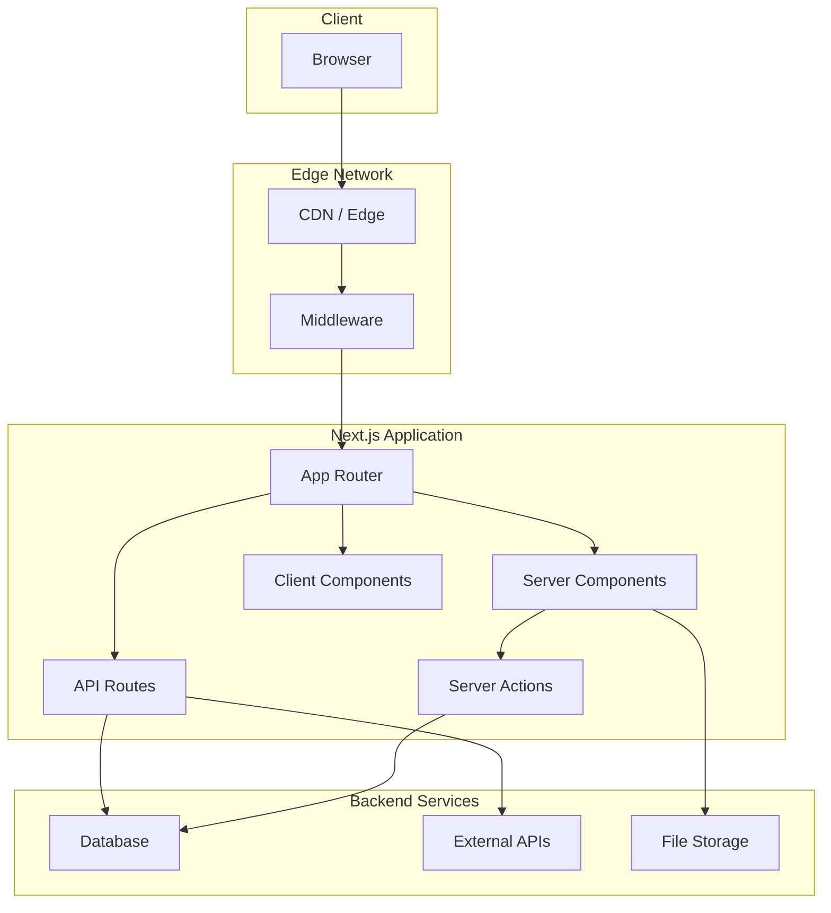
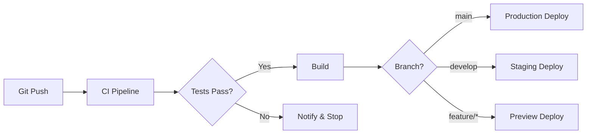

# Maintenance Guide

## {{PROJECT_NAME}} 유지보수 가이드

---

## 1. 시스템 개요

### 1.1 기술 스택

| 영역 | 기술 | 버전 |
|------|------|------|
| **Framework** | Next.js | 16.x |
| **Language** | TypeScript | 5.x |
| **Styling** | Tailwind CSS | 4.x |
| **UI Components** | shadcn/ui | latest |
| **State Management** | Zustand | {{ZUSTAND_VERSION}} |
| **Data Fetching** | React Query | {{RQ_VERSION}} |
| **Form** | react-hook-form + Zod | {{RHF_VERSION}} |

### 1.2 아키텍처 다이어그램



---

## 2. 개발 환경 설정

### 2.1 필수 요구사항

| 항목 | 최소 버전 | 권장 버전 |
|------|----------|----------|
| Node.js | 18.17.0 | 20.x LTS |
| npm | 9.x | 10.x |
| Git | 2.30 | latest |

### 2.2 프로젝트 설정

```bash
# 1. 저장소 클론
git clone {{REPO_URL}}
cd {{PROJECT_NAME}}

# 2. 의존성 설치
npm install

# 3. 환경 변수 설정
cp .env.example .env.local
# .env.local 파일 편집

# 4. 개발 서버 시작
npm run dev
```

### 2.3 환경 변수

| 변수명 | 설명 | 필수 | 예시 |
|--------|------|------|------|
| `DATABASE_URL` | 데이터베이스 연결 문자열 | ✅ | `postgresql://...` |
| `NEXTAUTH_SECRET` | 인증 시크릿 키 | ✅ | `your-secret-key` |
| `NEXT_PUBLIC_API_URL` | 공개 API URL | ✅ | `https://api.example.com` |
| {{ENV_VAR_1}} | {{ENV_VAR_1_DESC}} | {{ENV_VAR_1_REQ}} | {{ENV_VAR_1_EXAMPLE}} |
| {{ENV_VAR_2}} | {{ENV_VAR_2_DESC}} | {{ENV_VAR_2_REQ}} | {{ENV_VAR_2_EXAMPLE}} |

---

## 3. 프로젝트 구조

### 3.1 디렉토리 구조

```
{{PROJECT_NAME}}/
├── src/
│   ├── app/                    # App Router 페이지
│   │   ├── layout.tsx          # 루트 레이아웃
│   │   ├── page.tsx            # 홈페이지
│   │   ├── loading.tsx         # 로딩 UI
│   │   ├── error.tsx           # 에러 바운더리
│   │   ├── not-found.tsx       # 404 페이지
│   │   ├── (auth)/             # 인증 라우트 그룹
│   │   ├── (dashboard)/        # 대시보드 라우트 그룹
│   │   └── api/                # API 라우트
│   │
│   ├── components/
│   │   ├── ui/                 # shadcn/ui 컴포넌트
│   │   ├── features/           # 기능별 컴포넌트
│   │   └── layouts/            # 레이아웃 컴포넌트
│   │
│   ├── lib/
│   │   ├── utils.ts            # 유틸리티 함수
│   │   ├── api/                # API 클라이언트
│   │   └── validations/        # Zod 스키마
│   │
│   ├── stores/                 # Zustand 스토어
│   ├── hooks/                  # 커스텀 훅
│   ├── types/                  # TypeScript 타입
│   └── styles/                 # 글로벌 스타일
│
├── public/                     # 정적 파일
├── tests/                      # 테스트 파일
├── .env.example                # 환경 변수 예시
├── next.config.ts              # Next.js 설정
├── tailwind.config.ts          # Tailwind 설정
├── tsconfig.json               # TypeScript 설정
└── package.json
```

### 3.2 주요 파일 설명

| 파일 | 역할 | 수정 빈도 |
|------|------|----------|
| `next.config.ts` | Next.js 설정, 보안 헤더 | 낮음 |
| `tailwind.config.ts` | Tailwind 테마, 확장 | 중간 |
| `middleware.ts` | 인증, 리다이렉트 | 낮음 |
| `src/lib/utils.ts` | 공통 유틸리티 | 중간 |

---

## 4. 개발 가이드

### 4.1 코딩 컨벤션

#### 파일 명명 규칙

| 유형 | 규칙 | 예시 |
|------|------|------|
| 컴포넌트 | PascalCase | `UserProfile.tsx` |
| 훅 | camelCase, use 접두사 | `useAuth.ts` |
| 유틸리티 | camelCase | `formatDate.ts` |
| 타입 | PascalCase | `User.types.ts` |
| 상수 | SCREAMING_SNAKE_CASE | `API_ENDPOINTS.ts` |

#### 컴포넌트 구조

```typescript
// 1. Imports
import { useState } from 'react'
import { Button } from '@/components/ui/button'
import type { UserProps } from './User.types'

// 2. Types (if not in separate file)
interface Props extends UserProps {
  onSave: (data: User) => void
}

// 3. Component
export function UserProfile({ user, onSave }: Props) {
  // 3.1 Hooks
  const [isEditing, setIsEditing] = useState(false)

  // 3.2 Handlers
  const handleSave = () => {
    // ...
  }

  // 3.3 Render
  return (
    <div>
      {/* ... */}
    </div>
  )
}
```

### 4.2 새 기능 추가 가이드

#### 새 페이지 추가

```bash
# 1. 페이지 파일 생성
touch src/app/new-feature/page.tsx

# 2. 레이아웃 필요시
touch src/app/new-feature/layout.tsx

# 3. 로딩/에러 UI
touch src/app/new-feature/loading.tsx
touch src/app/new-feature/error.tsx
```

#### 새 API 라우트 추가

```typescript
// src/app/api/new-endpoint/route.ts
import { NextRequest, NextResponse } from 'next/server'

export async function GET(request: NextRequest) {
  // 구현
  return NextResponse.json({ data })
}

export async function POST(request: NextRequest) {
  const body = await request.json()
  // 구현
  return NextResponse.json({ success: true })
}
```

### 4.3 shadcn/ui 컴포넌트 추가

```bash
# 새 컴포넌트 추가
npx shadcn@latest add button
npx shadcn@latest add dialog
npx shadcn@latest add form

# 사용 가능한 컴포넌트 목록
npx shadcn@latest add --help
```

---

## 5. 빌드 및 배포

### 5.1 빌드 명령어

```bash
# 개발 서버
npm run dev

# 프로덕션 빌드
npm run build

# 프로덕션 실행
npm run start

# 타입 체크
npm run type-check

# 린트
npm run lint

# 테스트
npm run test
```

### 5.2 배포 프로세스



### 5.3 환경별 URL

| 환경 | URL | 용도 |
|------|-----|------|
| Production | {{PROD_URL}} | 실서비스 |
| Staging | {{STAGING_URL}} | 배포 전 테스트 |
| Preview | {{PREVIEW_URL_PATTERN}} | PR 프리뷰 |
| Local | http://localhost:3000 | 로컬 개발 |

---

## 6. 모니터링

### 6.1 로깅

```typescript
// 로깅 레벨
const LOG_LEVELS = {
  error: 0,    // 에러
  warn: 1,     // 경고
  info: 2,     // 정보
  debug: 3,    // 디버그
}

// 사용 예시
import { logger } from '@/lib/logger'

logger.info('User logged in', { userId: user.id })
logger.error('Database connection failed', { error })
```

### 6.2 에러 모니터링

| 도구 | 용도 | 대시보드 |
|------|------|----------|
| {{ERROR_MONITORING_TOOL}} | 에러 추적 | {{ERROR_DASHBOARD_URL}} |
| {{APM_TOOL}} | 성능 모니터링 | {{APM_DASHBOARD_URL}} |
| {{LOG_TOOL}} | 로그 집계 | {{LOG_DASHBOARD_URL}} |

### 6.3 알림 설정

| 이벤트 | 조건 | 알림 채널 |
|--------|------|----------|
| Error Rate | > 1% | {{ALERT_CHANNEL}} |
| Response Time | > 500ms | {{ALERT_CHANNEL}} |
| Server Down | Health check fail | {{ALERT_CHANNEL}} |

---

## 7. 문제 해결

### 7.1 일반적인 문제

#### 빌드 실패

```bash
# 캐시 삭제 후 재시도
rm -rf .next
rm -rf node_modules/.cache
npm run build
```

#### 타입 에러

```bash
# TypeScript 캐시 삭제
rm -rf node_modules/.cache/typescript
npm run type-check
```

#### 의존성 문제

```bash
# 의존성 재설치
rm -rf node_modules
rm package-lock.json
npm install
```

### 7.2 디버깅 팁

```typescript
// Server Component 디버깅
console.log('Server:', data) // 서버 터미널에 출력

// Client Component 디버깅
'use client'
console.log('Client:', data) // 브라우저 콘솔에 출력

// Next.js 디버그 모드
// next.config.ts
export default {
  logging: {
    fetches: {
      fullUrl: true,
    },
  },
}
```

### 7.3 자주 묻는 질문

<details>
<summary><strong>Q: hydration 에러가 발생합니다</strong></summary>

A: 서버와 클라이언트의 초기 렌더링이 다를 때 발생합니다.
- `useEffect`에서 클라이언트 전용 로직 처리
- `suppressHydrationWarning` 속성 사용 (주의 필요)
- 동적 import로 클라이언트 전용 컴포넌트 로드

</details>

<details>
<summary><strong>Q: Server Action이 작동하지 않습니다</strong></summary>

A: 다음을 확인하세요:
- 파일 상단에 `'use server'` 선언
- 함수가 async인지 확인
- 폼에서 `action` 속성 사용

</details>

---

## 8. 보안 가이드

### 8.1 보안 체크리스트

- [ ] 환경 변수에 시크릿 저장 (코드에 하드코딩 금지)
- [ ] HTTPS만 사용
- [ ] CSRF 토큰 활성화 (Server Actions 자동 적용)
- [ ] 입력 값 검증 (Zod 스키마)
- [ ] SQL Injection 방지 (Prepared Statements)
- [ ] XSS 방지 (React 자동 이스케이프)

### 8.2 의존성 업데이트

```bash
# 취약점 검사
npm audit

# 자동 수정
npm audit fix

# 의존성 업데이트 확인
npm outdated

# 안전한 업데이트
npm update
```

---

## 9. 성능 최적화

### 9.1 이미지 최적화

```typescript
import Image from 'next/image'

// 권장 사용법
<Image
  src="/hero.png"
  alt="Hero"
  width={1200}
  height={600}
  priority // LCP 이미지
  placeholder="blur"
  blurDataURL="data:..."
/>
```

### 9.2 폰트 최적화

```typescript
// src/app/layout.tsx
import { Inter } from 'next/font/google'

const inter = Inter({
  subsets: ['latin'],
  display: 'swap',
  variable: '--font-inter',
})
```

### 9.3 번들 분석

```bash
# 번들 분석
npm run build
npx @next/bundle-analyzer
```

---

## 10. 연락처 및 지원

### 10.1 팀 연락처

| 역할 | 이름 | 연락처 |
|------|------|--------|
| Tech Lead | {{TECH_LEAD}} | {{TECH_LEAD_EMAIL}} |
| DevOps | {{DEVOPS}} | {{DEVOPS_EMAIL}} |
| Support | {{SUPPORT}} | {{SUPPORT_EMAIL}} |

### 10.2 유용한 링크

| 리소스 | URL |
|--------|-----|
| Next.js 공식 문서 | https://nextjs.org/docs |
| TypeScript 핸드북 | https://www.typescriptlang.org/docs |
| Tailwind CSS 문서 | https://tailwindcss.com/docs |
| shadcn/ui 문서 | https://ui.shadcn.com |
| 프로젝트 위키 | {{WIKI_URL}} |
| 이슈 트래커 | {{ISSUE_TRACKER_URL}} |

---

**Document**: 07_maintenance_guide.md (Post-Migration)
**Generated**: {{DATE}}
**Previous**: [← Cost Benefit Analysis](./06_cost_benefit_analysis.md)
**Cover**: [← Back to Cover](./00_cover.md)
