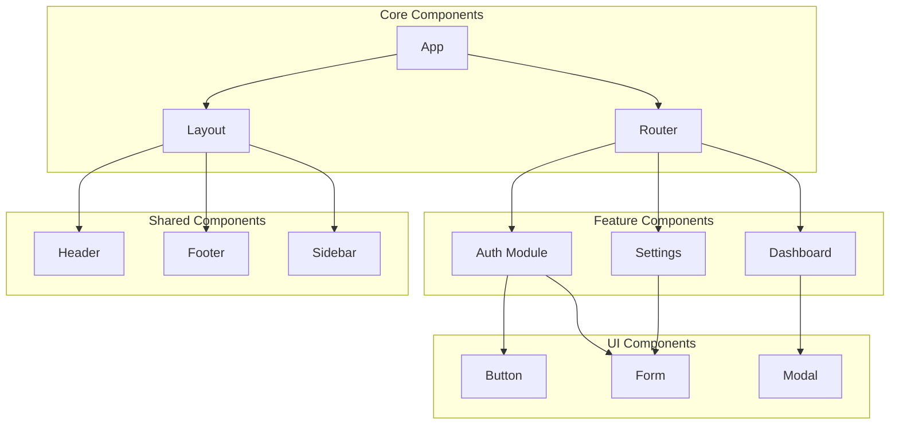
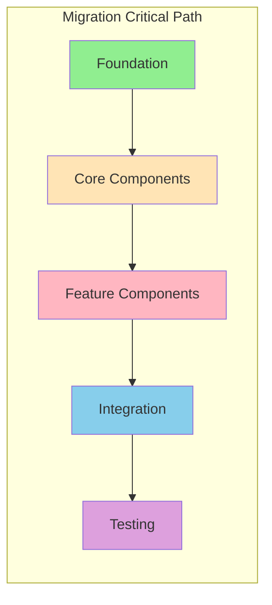

# Complexity Matrix

## {{PROJECT_NAME}} Component Complexity Analysis

---

## 1. Complexity Scoring Criteria

### 1.1 Scoring Dimensions

| Dimension | Weight | 1 (Low) | 3 (Medium) | 5 (High) |
|-----------|--------|---------|------------|----------|
| **Lines of Code** | 20% | < 100 lines | 100-500 lines | > 500 lines |
| **Dependencies** | 25% | 0-2 imports | 3-7 imports | > 7 imports |
| **State Complexity** | 25% | Stateless | Local state | Global state + Side effects |
| **UI Complexity** | 15% | Simple display | Forms/Lists | Complex interactions |
| **Business Logic** | 15% | None | Validation | Complex calculations |

### 1.2 Overall Score Calculation

```
Overall Score = (LOC × 0.20) + (Deps × 0.25) + (State × 0.25) + (UI × 0.15) + (Logic × 0.15)
```

### 1.3 Effort Estimation Formula

| Score Range | Complexity Level | Base Hours | Risk Multiplier |
|-------------|------------------|------------|-----------------|
| 1.0 - 1.5 | Very Low | 2-4h | 1.0x |
| 1.5 - 2.5 | Low | 4-8h | 1.1x |
| 2.5 - 3.5 | Medium | 8-16h | 1.3x |
| 3.5 - 4.5 | High | 16-32h | 1.5x |
| 4.5 - 5.0 | Very High | 32-64h | 2.0x |

---

## 2. Component Complexity Matrix

### 2.1 Full Component Analysis

| Component | Path | LOC | Deps | State | UI | Logic | Score | Effort | Priority |
|-----------|------|-----|------|-------|-----|-------|-------|--------|----------|
| {{COMP_1}} | {{COMP_1_PATH}} | {{COMP_1_LOC}} | {{COMP_1_DEPS}} | {{COMP_1_STATE}} | {{COMP_1_UI}} | {{COMP_1_LOGIC}} | {{COMP_1_SCORE}} | {{COMP_1_EFFORT}} | {{COMP_1_PRIORITY}} |
| {{COMP_2}} | {{COMP_2_PATH}} | {{COMP_2_LOC}} | {{COMP_2_DEPS}} | {{COMP_2_STATE}} | {{COMP_2_UI}} | {{COMP_2_LOGIC}} | {{COMP_2_SCORE}} | {{COMP_2_EFFORT}} | {{COMP_2_PRIORITY}} |
| {{COMP_3}} | {{COMP_3_PATH}} | {{COMP_3_LOC}} | {{COMP_3_DEPS}} | {{COMP_3_STATE}} | {{COMP_3_UI}} | {{COMP_3_LOGIC}} | {{COMP_3_SCORE}} | {{COMP_3_EFFORT}} | {{COMP_3_PRIORITY}} |
| {{COMP_4}} | {{COMP_4_PATH}} | {{COMP_4_LOC}} | {{COMP_4_DEPS}} | {{COMP_4_STATE}} | {{COMP_4_UI}} | {{COMP_4_LOGIC}} | {{COMP_4_SCORE}} | {{COMP_4_EFFORT}} | {{COMP_4_PRIORITY}} |
| {{COMP_5}} | {{COMP_5_PATH}} | {{COMP_5_LOC}} | {{COMP_5_DEPS}} | {{COMP_5_STATE}} | {{COMP_5_UI}} | {{COMP_5_LOGIC}} | {{COMP_5_SCORE}} | {{COMP_5_EFFORT}} | {{COMP_5_PRIORITY}} |

### 2.2 Complexity Distribution

```
복잡도 분포
────────────────────────────────────────────────────────
Very Low  (1.0-1.5) : {{DIST_VERY_LOW}}개  ████████░░░░░░░░
Low       (1.5-2.5) : {{DIST_LOW}}개       ████████████░░░░
Medium    (2.5-3.5) : {{DIST_MEDIUM}}개    ██████████████░░
High      (3.5-4.5) : {{DIST_HIGH}}개      ████░░░░░░░░░░░░
Very High (4.5-5.0) : {{DIST_VERY_HIGH}}개 ██░░░░░░░░░░░░░░
────────────────────────────────────────────────────────
Total Components: {{TOTAL_COMPONENTS}}개
Average Score: {{AVG_SCORE}}
```

---

## 3. Dependency Graph

### 3.1 Component Dependencies



### 3.2 Critical Path Analysis



---

## 4. Work Breakdown Structure (WBS)

### 4.1 Phase Overview

| Phase | Components | Est. Hours | Team Size | Duration |
|-------|------------|------------|-----------|----------|
| Phase 1: Foundation | {{P1_COMPONENTS}} | {{P1_HOURS}}h | {{P1_TEAM}} | {{P1_DURATION}} |
| Phase 2: Core | {{P2_COMPONENTS}} | {{P2_HOURS}}h | {{P2_TEAM}} | {{P2_DURATION}} |
| Phase 3: Features | {{P3_COMPONENTS}} | {{P3_HOURS}}h | {{P3_TEAM}} | {{P3_DURATION}} |
| Phase 4: Polish | {{P4_COMPONENTS}} | {{P4_HOURS}}h | {{P4_TEAM}} | {{P4_DURATION}} |

### 4.2 Phase 1: Foundation Setup

| Task | Components | Complexity | Hours | Dependencies |
|------|------------|------------|-------|--------------|
| Project scaffolding | - | Low | {{TASK_1_1_HOURS}} | None |
| Next.js configuration | - | Low | {{TASK_1_2_HOURS}} | Task 1.1 |
| Base layout migration | Layout, Header, Footer | {{TASK_1_3_COMPLEXITY}} | {{TASK_1_3_HOURS}} | Task 1.2 |
| Styling setup | - | Low | {{TASK_1_4_HOURS}} | Task 1.2 |

### 4.3 Phase 2: Core Components

| Task | Components | Complexity | Hours | Dependencies |
|------|------------|------------|-------|--------------|
| Router migration | App Router setup | {{TASK_2_1_COMPLEXITY}} | {{TASK_2_1_HOURS}} | Phase 1 |
| State management | Store migration | {{TASK_2_2_COMPLEXITY}} | {{TASK_2_2_HOURS}} | Phase 1 |
| API integration | API Routes | {{TASK_2_3_COMPLEXITY}} | {{TASK_2_3_HOURS}} | Task 2.1 |
| Auth flow | Auth components | {{TASK_2_4_COMPLEXITY}} | {{TASK_2_4_HOURS}} | Task 2.2, 2.3 |

### 4.4 Phase 3: Feature Components

| Task | Components | Complexity | Hours | Dependencies |
|------|------------|------------|-------|--------------|
| Dashboard | Dashboard, Charts | {{TASK_3_1_COMPLEXITY}} | {{TASK_3_1_HOURS}} | Phase 2 |
| Settings | Settings, Forms | {{TASK_3_2_COMPLEXITY}} | {{TASK_3_2_HOURS}} | Phase 2 |
| Data Tables | Table, Pagination | {{TASK_3_3_COMPLEXITY}} | {{TASK_3_3_HOURS}} | Phase 2 |
| Modals & Overlays | Modal, Drawer | {{TASK_3_4_COMPLEXITY}} | {{TASK_3_4_HOURS}} | Phase 2 |

### 4.5 Phase 4: Polish & Optimization

| Task | Components | Complexity | Hours | Dependencies |
|------|------------|------------|-------|--------------|
| Performance optimization | All | Medium | {{TASK_4_1_HOURS}} | Phase 3 |
| Accessibility audit | All | Medium | {{TASK_4_2_HOURS}} | Phase 3 |
| Testing & QA | All | High | {{TASK_4_3_HOURS}} | Phase 3 |
| Documentation | - | Low | {{TASK_4_4_HOURS}} | All |

---

## 5. Effort Summary

### 5.1 Total Effort Breakdown

| Category | Hours | Percentage |
|----------|-------|------------|
| Component Migration | {{EFFORT_COMPONENTS}} | {{EFFORT_COMPONENTS_PCT}}% |
| State Management | {{EFFORT_STATE}} | {{EFFORT_STATE_PCT}}% |
| API Integration | {{EFFORT_API}} | {{EFFORT_API_PCT}}% |
| Testing | {{EFFORT_TESTING}} | {{EFFORT_TESTING_PCT}}% |
| Documentation | {{EFFORT_DOCS}} | {{EFFORT_DOCS_PCT}}% |
| Buffer (Risk) | {{EFFORT_BUFFER}} | {{EFFORT_BUFFER_PCT}}% |
| **Total** | **{{TOTAL_HOURS}}** | **100%** |

### 5.2 Resource Recommendations

```
권장 팀 구성
────────────────────────────────────────────────────────
Senior Frontend Developer : {{REC_SENIOR}}명 (리드, 복잡 컴포넌트)
Mid-level Developer       : {{REC_MID}}명 (일반 컴포넌트)
QA Engineer               : {{REC_QA}}명 (테스트, 검증)
────────────────────────────────────────────────────────
총 인원: {{REC_TOTAL}}명
예상 기간: {{REC_DURATION}}
```

### 5.3 Parallel Work Opportunities

| Work Stream | Components | Can Parallelize With |
|-------------|------------|---------------------|
| Stream A | Layout, Header, Footer | Stream B, C |
| Stream B | Auth, Login, Register | Stream A, C |
| Stream C | Dashboard, Charts | Stream A, B |
| Stream D | Settings, Forms | After A, B, C |

---

## 6. Risk-Adjusted Estimates

### 6.1 Confidence Levels

| Estimate Type | Hours | Confidence | Scenario |
|---------------|-------|------------|----------|
| Optimistic | {{EST_OPTIMISTIC}} | 90% | Everything goes smoothly |
| Expected | {{EST_EXPECTED}} | 75% | Normal challenges |
| Pessimistic | {{EST_PESSIMISTIC}} | 95% | Significant blockers |

### 6.2 Risk Factors Applied

| Risk | Impact on Estimate | Mitigation |
|------|-------------------|------------|
| {{RISK_1}} | +{{RISK_1_HOURS}}h | {{RISK_1_MITIGATION}} |
| {{RISK_2}} | +{{RISK_2_HOURS}}h | {{RISK_2_MITIGATION}} |
| {{RISK_3}} | +{{RISK_3_HOURS}}h | {{RISK_3_MITIGATION}} |

---

**Document**: 04_complexity_matrix.md
**Generated**: {{DATE}}
**Previous**: [← Architecture Report](./03_architecture_report.md)
**Next**: [Migration Roadmap →](./05_migration_roadmap.md)
