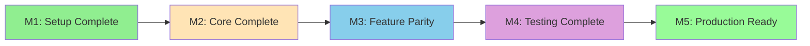
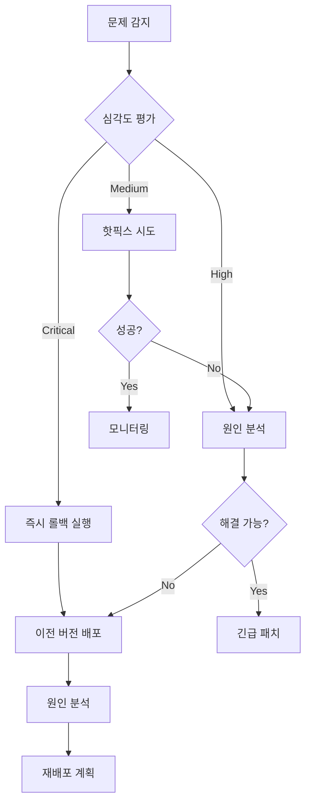

# Migration Roadmap

## {{PROJECT_NAME}} Migration Implementation Plan

---

## 1. Phase Overview

### 1.1 High-Level Timeline

| Phase | Name | Duration | Start | End | Deliverables |
|-------|------|----------|-------|-----|--------------|
| Phase 1 | 준비 및 설정 | {{P1_DURATION}} | {{P1_START}} | {{P1_END}} | 프로젝트 기반 구조 |
| Phase 2 | 핵심 마이그레이션 | {{P2_DURATION}} | {{P2_START}} | {{P2_END}} | 핵심 기능 이전 |
| Phase 3 | 고급 기능 | {{P3_DURATION}} | {{P3_START}} | {{P3_END}} | 전체 기능 완성 |
| Phase 4 | 테스트 및 최적화 | {{P4_DURATION}} | {{P4_START}} | {{P4_END}} | 배포 준비 완료 |

### 1.2 Visual Timeline

```
{{YEAR}}-{{MONTH}}
────────────────────────────────────────────────────────────────────
Week 1-2   │ Phase 1: Setup ████████░░░░░░░░░░░░░░░░░░░░░░░░░░░░░░
Week 3-6   │ Phase 2: Core  ░░░░░░░░████████████████░░░░░░░░░░░░░░
Week 7-9   │ Phase 3: Adv   ░░░░░░░░░░░░░░░░░░░░░░░░████████████░░
Week 10-11 │ Phase 4: QA    ░░░░░░░░░░░░░░░░░░░░░░░░░░░░░░░░░░████
────────────────────────────────────────────────────────────────────
            Total: {{TOTAL_WEEKS}} weeks
```

---

## 2. Detailed Timeline (Gantt Chart)

```mermaid
gantt
    title {{PROJECT_NAME}} Migration Roadmap
    dateFormat  YYYY-MM-DD

    section Phase 1: Setup
    Project scaffolding       :p1_1, {{P1_START}}, 2d
    Next.js configuration     :p1_2, after p1_1, 2d
    Tailwind & UI setup       :p1_3, after p1_2, 2d
    Base layout migration     :p1_4, after p1_3, 3d
    CI/CD setup               :p1_5, after p1_1, 5d

    section Phase 2: Core
    App Router setup          :p2_1, after p1_4, 3d
    State management          :p2_2, after p2_1, 4d
    API routes migration      :p2_3, after p2_1, 5d
    Auth flow implementation  :p2_4, after p2_2, 5d
    Core components           :p2_5, after p2_3, 7d

    section Phase 3: Advanced
    Dashboard features        :p3_1, after p2_5, 5d
    Settings & forms          :p3_2, after p2_5, 4d
    Data tables               :p3_3, after p3_1, 4d
    Modal & overlays          :p3_4, after p3_2, 3d
    Integration testing       :p3_5, after p3_3, 3d

    section Phase 4: QA
    Performance optimization  :p4_1, after p3_5, 3d
    Accessibility audit       :p4_2, after p4_1, 2d
    Security review           :p4_3, after p4_1, 2d
    Final QA & bug fixes      :p4_4, after p4_2, 3d
    Documentation             :p4_5, after p4_4, 2d

    section Milestones
    M1: Setup Complete        :milestone, m1, after p1_5, 0d
    M2: Core Complete         :milestone, m2, after p2_5, 0d
    M3: Feature Parity        :milestone, m3, after p3_5, 0d
    M4: Production Ready      :milestone, m4, after p4_5, 0d
```

---

## 3. Milestone Definitions

### 3.1 Milestone Details

| ID | Milestone | Target Date | Success Criteria |
|----|-----------|-------------|------------------|
| M1 | Setup Complete | {{M1_DATE}} | {{M1_CRITERIA}} |
| M2 | Core Complete | {{M2_DATE}} | {{M2_CRITERIA}} |
| M3 | Feature Parity | {{M3_DATE}} | {{M3_CRITERIA}} |
| M4 | Testing Complete | {{M4_DATE}} | {{M4_CRITERIA}} |
| M5 | Production Ready | {{M5_DATE}} | {{M5_CRITERIA}} |

### 3.2 Milestone Dependencies



---

## 4. Quality Gates

### 4.1 Phase Entry/Exit Criteria

| Phase | Entry Criteria | Exit Criteria | Validation Method |
|-------|----------------|---------------|-------------------|
| Phase 1 | 프로젝트 승인 완료 | 개발 환경 구축 완료 | 체크리스트 검증 |
| Phase 2 | Phase 1 완료 | 핵심 기능 테스트 통과 | 자동화 테스트 |
| Phase 3 | Phase 2 완료 | 기능 동등성 확인 | E2E 테스트 |
| Phase 4 | Phase 3 완료 | 품질 기준 충족 | QA 승인 |

### 4.2 Quality Checkpoints

```
품질 검증 체크포인트
────────────────────────────────────────────────────────
[Phase 1 Exit]
☐ Next.js 프로젝트 빌드 성공
☐ TypeScript 컴파일 오류 없음
☐ Tailwind CSS 정상 작동
☐ CI/CD 파이프라인 구축 완료

[Phase 2 Exit]
☐ 라우팅 100% 구현
☐ 상태 관리 마이그레이션 완료
☐ API 통합 테스트 통과
☐ 인증/인가 플로우 검증

[Phase 3 Exit]
☐ 모든 기능 구현 완료
☐ 기존 시스템과 기능 동등성 확인
☐ 통합 테스트 커버리지 80% 이상
☐ 성능 기준선 충족

[Phase 4 Exit]
☐ 성능 최적화 완료 (Core Web Vitals)
☐ 접근성 WCAG 2.1 AA 준수
☐ 보안 취약점 0건
☐ 문서화 100% 완료
────────────────────────────────────────────────────────
```

---

## 5. Rollback Plan

### 5.1 Rollback Triggers

| Trigger | Severity | Action | Decision Maker |
|---------|----------|--------|----------------|
| 치명적 버그 발견 | Critical | 즉시 롤백 | Tech Lead |
| 성능 저하 > 30% | High | 원인 분석 후 결정 | PM + Tech Lead |
| 데이터 무결성 문제 | Critical | 즉시 롤백 | Tech Lead |
| 사용자 경험 심각한 저하 | High | 부분 롤백 검토 | PM |

### 5.2 Rollback Procedure



### 5.3 Data Preservation Strategy

| Data Type | Backup Frequency | Retention | Recovery Time |
|-----------|------------------|-----------|---------------|
| User Data | Real-time | 30 days | < 1 hour |
| Configuration | On change | 90 days | < 15 min |
| Application State | Hourly | 7 days | < 30 min |
| Logs | Continuous | 30 days | < 5 min |

---

## 6. Resource Allocation

### 6.1 Team Composition

| Role | Count | Phase 1 | Phase 2 | Phase 3 | Phase 4 |
|------|-------|---------|---------|---------|---------|
| Tech Lead | 1 | 50% | 30% | 20% | 30% |
| Senior Dev | {{SENIOR_COUNT}} | 100% | 100% | 80% | 50% |
| Mid Dev | {{MID_COUNT}} | 100% | 100% | 100% | 60% |
| QA Engineer | {{QA_COUNT}} | 20% | 40% | 60% | 100% |
| DevOps | 1 | 80% | 30% | 20% | 40% |

### 6.2 Skill Requirements

| Skill | Required Level | Team Members | Gap |
|-------|---------------|--------------|-----|
| Next.js App Router | Advanced | {{SKILL_NEXTJS}} | {{GAP_NEXTJS}} |
| TypeScript | Intermediate | {{SKILL_TS}} | {{GAP_TS}} |
| React Server Components | Advanced | {{SKILL_RSC}} | {{GAP_RSC}} |
| Tailwind CSS | Intermediate | {{SKILL_TAILWIND}} | {{GAP_TAILWIND}} |

### 6.3 Training Needs

| Topic | Duration | Target Audience | Priority |
|-------|----------|-----------------|----------|
| Next.js 16 App Router | {{TRAIN_1_DURATION}} | All Devs | High |
| React Server Components | {{TRAIN_2_DURATION}} | Senior Devs | High |
| Tailwind CSS v4 | {{TRAIN_3_DURATION}} | All Devs | Medium |
| Testing Strategies | {{TRAIN_4_DURATION}} | All + QA | Medium |

---

## 7. Communication Plan

### 7.1 Meeting Schedule

| Meeting | Frequency | Participants | Duration |
|---------|-----------|--------------|----------|
| Daily Standup | Daily | Dev Team | 15 min |
| Sprint Planning | Bi-weekly | All | 2 hours |
| Sprint Review | Bi-weekly | All + Stakeholders | 1 hour |
| Technical Sync | Weekly | Dev Team | 1 hour |
| Stakeholder Update | Weekly | PM + Stakeholders | 30 min |

### 7.2 Reporting Structure

```
보고 체계
────────────────────────────────────────────────────────
Daily   : 일일 진행 상황 (Slack/Teams)
Weekly  : 주간 진행 보고서 (이메일)
Bi-weekly: 스프린트 리뷰 (미팅)
Monthly : 월간 마이그레이션 현황 (경영진 보고)
────────────────────────────────────────────────────────
```

---

## 8. Risk Management Timeline

### 8.1 Risk Monitoring Schedule

| Week | Focus Area | Key Risks to Monitor | Mitigation Actions |
|------|------------|---------------------|-------------------|
| 1-2 | Setup | 환경 설정 문제 | 사전 검증 |
| 3-4 | Core Migration | 호환성 이슈 | 단계적 전환 |
| 5-6 | State/API | 데이터 무결성 | 자동화 테스트 |
| 7-8 | Features | 기능 누락 | 체크리스트 |
| 9-10 | QA | 성능 저하 | 지속적 모니터링 |
| 11 | Release | 배포 실패 | 롤백 계획 |

### 8.2 Contingency Buffer

```
여유 시간 배분
────────────────────────────────────────────────────────
Phase 1 Buffer : {{P1_BUFFER}} (예상치 못한 설정 이슈)
Phase 2 Buffer : {{P2_BUFFER}} (복잡한 마이그레이션)
Phase 3 Buffer : {{P3_BUFFER}} (기능 완성도)
Phase 4 Buffer : {{P4_BUFFER}} (버그 수정)
────────────────────────────────────────────────────────
Total Buffer   : {{TOTAL_BUFFER}} (전체의 {{BUFFER_PCT}}%)
```

---

## 9. Success Metrics

### 9.1 Key Performance Indicators

| KPI | Target | Measurement | Frequency |
|-----|--------|-------------|-----------|
| 마일스톤 준수율 | > 90% | 예정 vs 실제 | Weekly |
| 버그 발생률 | < 5/sprint | Bug tracker | Sprint |
| 테스트 커버리지 | > 80% | CI/CD | Daily |
| 팀 생산성 | > 85% | Story points | Sprint |

### 9.2 Go-Live Criteria

| Criteria | Threshold | Status |
|----------|-----------|--------|
| 기능 완성도 | 100% | ☐ |
| 테스트 통과율 | 100% | ☐ |
| 성능 기준 충족 | Core Web Vitals | ☐ |
| 보안 취약점 | 0 Critical/High | ☐ |
| 문서화 완료 | 100% | ☐ |
| 스테이크홀더 승인 | 완료 | ☐ |

---

**Document**: 05_migration_roadmap.md
**Generated**: {{DATE}}
**Previous**: [← Complexity Matrix](./04_complexity_matrix.md)
**Next**: [Baseline Report →](./06_baseline_report.md)
