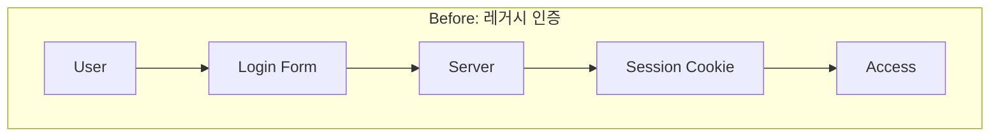
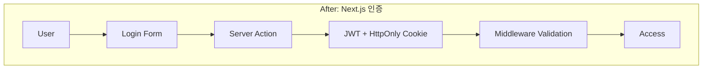

# Security Improvement Report

## jikime-adk-v2 보안 개선 보고서

---

## 1. 보안 평가 개요

### 1.1 평가 범위

| 항목 | 설명 |
|------|------|
| **평가 대상** | jikime-adk-v2 웹 애플리케이션 |
| **평가 기간** | {{ASSESSMENT_PERIOD}} |
| **평가 기준** | OWASP Top 10, CWE/SANS Top 25 |
| **평가 도구** | {{ASSESSMENT_TOOLS}} |

### 1.2 평가 결과 요약

```
보안 취약점 비교
────────────────────────────────────────────────────────
              Before          After           변화
────────────────────────────────────────────────────────
Critical      {{VULN_CRITICAL_BEFORE}}개        {{VULN_CRITICAL_AFTER}}개           ↓{{VULN_CRITICAL_IMPROVEMENT}}%
High          {{VULN_HIGH_BEFORE}}개            {{VULN_HIGH_AFTER}}개               ↓{{VULN_HIGH_IMPROVEMENT}}%
Medium        {{VULN_MEDIUM_BEFORE}}개          {{VULN_MEDIUM_AFTER}}개             ↓{{VULN_MEDIUM_IMPROVEMENT}}%
Low           {{VULN_LOW_BEFORE}}개             {{VULN_LOW_AFTER}}개                ↓{{VULN_LOW_IMPROVEMENT}}%
────────────────────────────────────────────────────────
Total         {{VULN_TOTAL_BEFORE}}개           {{VULN_TOTAL_AFTER}}개              ↓{{VULN_TOTAL_IMPROVEMENT}}%
────────────────────────────────────────────────────────
```

---

## 2. OWASP Top 10 대응 현황

### 2.1 상세 대응 상태

| # | 취약점 유형 | Before | After | 개선 내용 |
|---|------------|--------|-------|----------|
| A01 | Broken Access Control | {{A01_BEFORE}} | {{A01_AFTER}} | {{A01_IMPROVEMENT}} |
| A02 | Cryptographic Failures | {{A02_BEFORE}} | {{A02_AFTER}} | {{A02_IMPROVEMENT}} |
| A03 | Injection | {{A03_BEFORE}} | {{A03_AFTER}} | {{A03_IMPROVEMENT}} |
| A04 | Insecure Design | {{A04_BEFORE}} | {{A04_AFTER}} | {{A04_IMPROVEMENT}} |
| A05 | Security Misconfiguration | {{A05_BEFORE}} | {{A05_AFTER}} | {{A05_IMPROVEMENT}} |
| A06 | Vulnerable Components | {{A06_BEFORE}} | {{A06_AFTER}} | {{A06_IMPROVEMENT}} |
| A07 | Auth Failures | {{A07_BEFORE}} | {{A07_AFTER}} | {{A07_IMPROVEMENT}} |
| A08 | Data Integrity Failures | {{A08_BEFORE}} | {{A08_AFTER}} | {{A08_IMPROVEMENT}} |
| A09 | Security Logging | {{A09_BEFORE}} | {{A09_AFTER}} | {{A09_IMPROVEMENT}} |
| A10 | SSRF | {{A10_BEFORE}} | {{A10_AFTER}} | {{A10_IMPROVEMENT}} |

### 2.2 시각화

```mermaid
graph TD
    subgraph "OWASP Top 10 대응 상태"
        A01[A01: Access Control] --> |{{A01_AFTER}}| A01_S[{{A01_STATUS}}]
        A02[A02: Cryptographic] --> |{{A02_AFTER}}| A02_S[{{A02_STATUS}}]
        A03[A03: Injection] --> |{{A03_AFTER}}| A03_S[{{A03_STATUS}}]
        A04[A04: Insecure Design] --> |{{A04_AFTER}}| A04_S[{{A04_STATUS}}]
        A05[A05: Misconfiguration] --> |{{A05_AFTER}}| A05_S[{{A05_STATUS}}]
    end

    style A01_S fill:#90EE90
    style A02_S fill:#90EE90
    style A03_S fill:#90EE90
    style A04_S fill:#90EE90
    style A05_S fill:#90EE90
```

---

## 3. 보안 헤더 개선

### 3.1 HTTP 보안 헤더 비교

| 헤더 | Before | After | 설명 |
|------|--------|-------|------|
| **Content-Security-Policy** | {{CSP_BEFORE}} | {{CSP_AFTER}} | XSS 방지 |
| **X-Frame-Options** | {{XFO_BEFORE}} | {{XFO_AFTER}} | 클릭재킹 방지 |
| **X-Content-Type-Options** | {{XCTO_BEFORE}} | {{XCTO_AFTER}} | MIME 스니핑 방지 |
| **Strict-Transport-Security** | {{HSTS_BEFORE}} | {{HSTS_AFTER}} | HTTPS 강제 |
| **X-XSS-Protection** | {{XXSS_BEFORE}} | {{XXSS_AFTER}} | XSS 필터 |
| **Referrer-Policy** | {{RP_BEFORE}} | {{RP_AFTER}} | 리퍼러 제어 |
| **Permissions-Policy** | {{PP_BEFORE}} | {{PP_AFTER}} | 기능 제한 |

### 3.2 Next.js 보안 설정

```typescript
// next.config.ts - Security Headers
const securityHeaders = [
  {
    key: 'Content-Security-Policy',
    value: "{{CSP_VALUE}}"
  },
  {
    key: 'Strict-Transport-Security',
    value: 'max-age=63072000; includeSubDomains; preload'
  },
  {
    key: 'X-Frame-Options',
    value: 'DENY'
  },
  {
    key: 'X-Content-Type-Options',
    value: 'nosniff'
  },
  {
    key: 'Referrer-Policy',
    value: 'strict-origin-when-cross-origin'
  }
]
```

---

## 4. 의존성 보안 개선

### 4.1 취약한 패키지 제거

| 패키지 | 이전 버전 | 취약점 | 조치 |
|--------|----------|--------|------|
| {{PKG_1}} | {{PKG_1_VER_BEFORE}} | {{PKG_1_VULN}} | {{PKG_1_ACTION}} |
| {{PKG_2}} | {{PKG_2_VER_BEFORE}} | {{PKG_2_VULN}} | {{PKG_2_ACTION}} |
| {{PKG_3}} | {{PKG_3_VER_BEFORE}} | {{PKG_3_VULN}} | {{PKG_3_ACTION}} |
| {{PKG_4}} | {{PKG_4_VER_BEFORE}} | {{PKG_4_VULN}} | {{PKG_4_ACTION}} |

### 4.2 의존성 감사 결과

```
npm audit 결과 비교
────────────────────────────────────────────────────────
Before:
  {{AUDIT_CRITICAL_BEFORE}} critical | {{AUDIT_HIGH_BEFORE}} high | {{AUDIT_MODERATE_BEFORE}} moderate | {{AUDIT_LOW_BEFORE}} low

After:
  {{AUDIT_CRITICAL_AFTER}} critical | {{AUDIT_HIGH_AFTER}} high | {{AUDIT_MODERATE_AFTER}} moderate | {{AUDIT_LOW_AFTER}} low

개선: {{AUDIT_IMPROVEMENT}}% 취약점 감소
────────────────────────────────────────────────────────
```

---

## 5. 인증/인가 개선

### 5.1 인증 플로우 비교





### 5.2 개선 사항

| 영역 | Before | After | 보안 향상 |
|------|--------|-------|----------|
| **토큰 저장** | {{TOKEN_STORAGE_BEFORE}} | HttpOnly Cookie | XSS 방지 |
| **토큰 전송** | {{TOKEN_TRANSPORT_BEFORE}} | Secure + SameSite | CSRF 방지 |
| **세션 관리** | {{SESSION_BEFORE}} | JWT + Refresh Token | 세션 하이재킹 방지 |
| **권한 검증** | {{AUTH_CHECK_BEFORE}} | Middleware + Server | 우회 방지 |

---

## 6. XSS/CSRF 방어

### 6.1 XSS 방어 개선

| 방어 기법 | Before | After |
|----------|--------|-------|
| 입력 검증 | {{XSS_INPUT_BEFORE}} | Zod + Server Validation |
| 출력 인코딩 | {{XSS_OUTPUT_BEFORE}} | React 자동 이스케이프 |
| CSP | {{XSS_CSP_BEFORE}} | Strict CSP 적용 |
| DOM 조작 | {{XSS_DOM_BEFORE}} | dangerouslySetInnerHTML 제거 |

### 6.2 CSRF 방어 개선

| 방어 기법 | Before | After |
|----------|--------|-------|
| 토큰 방식 | {{CSRF_TOKEN_BEFORE}} | Server Actions (자동 보호) |
| SameSite Cookie | {{CSRF_SAMESITE_BEFORE}} | SameSite=Strict |
| Origin 검증 | {{CSRF_ORIGIN_BEFORE}} | Middleware Origin Check |

---

## 7. 데이터 보호 개선

### 7.1 민감 데이터 처리

| 데이터 유형 | Before | After | 준수 사항 |
|------------|--------|-------|----------|
| 비밀번호 | {{PW_BEFORE}} | bcrypt (cost 12) | NIST 권장 |
| 개인정보 | {{PII_BEFORE}} | 암호화 저장 | GDPR/PIPA |
| API 키 | {{API_KEY_BEFORE}} | 환경 변수 분리 | 12 Factor |
| 세션 데이터 | {{SESSION_DATA_BEFORE}} | 서버 사이드 전용 | 최소 노출 |

### 7.2 환경 변수 분리

```
환경 변수 보안 개선
────────────────────────────────────────────────────────
Before: 클라이언트에 민감 정보 노출 위험

After:
├── .env.local          (로컬 개발용, Git 제외)
├── .env.production     (프로덕션, 암호화 저장)
└── NEXT_PUBLIC_*       (클라이언트 공개용만)

✅ 서버 전용 변수는 클라이언트 번들에 포함되지 않음
────────────────────────────────────────────────────────
```

---

## 8. 보안 모니터링

### 8.1 로깅 개선

| 로그 유형 | Before | After |
|----------|--------|-------|
| 인증 실패 | {{LOG_AUTH_BEFORE}} | 구조화된 로깅 + 알림 |
| 권한 거부 | {{LOG_PERM_BEFORE}} | 실시간 모니터링 |
| 이상 징후 | {{LOG_ANOMALY_BEFORE}} | AI 기반 탐지 |
| 감사 추적 | {{LOG_AUDIT_BEFORE}} | 완전한 감사 로그 |

### 8.2 보안 알림 설정

```
보안 알림 체계
────────────────────────────────────────────────────────
[Critical] 즉시 알림 (Slack, Email, SMS)
├── 대량 인증 실패 (>10회/분)
├── 권한 상승 시도
└── 알려진 공격 패턴 탐지

[High] 1시간 내 검토
├── 비정상 접근 패턴
├── 새로운 IP에서 관리자 로그인
└── API 요청 급증

[Medium] 일간 보고서
├── 실패한 로그인 시도
├── 만료된 토큰 접근
└── 비정상 사용 패턴
────────────────────────────────────────────────────────
```

---

## 9. 컴플라이언스 상태

### 9.1 규정 준수 현황

| 규정 | Before | After | 상태 |
|------|--------|-------|------|
| OWASP Top 10 | {{OWASP_BEFORE}} | {{OWASP_AFTER}} | {{OWASP_STATUS}} |
| GDPR | {{GDPR_BEFORE}} | {{GDPR_AFTER}} | {{GDPR_STATUS}} |
| PIPA (개인정보보호법) | {{PIPA_BEFORE}} | {{PIPA_AFTER}} | {{PIPA_STATUS}} |
| PCI-DSS | {{PCI_BEFORE}} | {{PCI_AFTER}} | {{PCI_STATUS}} |

---

## 10. 권장 사항

### 10.1 즉시 조치 필요

- [ ] {{SEC_IMMEDIATE_1}}
- [ ] {{SEC_IMMEDIATE_2}}

### 10.2 정기 보안 활동

- [ ] 월간 의존성 업데이트 및 감사
- [ ] 분기별 침투 테스트
- [ ] 연간 보안 감사 및 인증 갱신

---

**Document**: 03_security_improvement.md (Post-Migration)
**Generated**: {{DATE}}
**Previous**: [← Performance Comparison](./02_performance_comparison.md)
**Next**: [Code Quality Report →](./04_code_quality_report.md)
