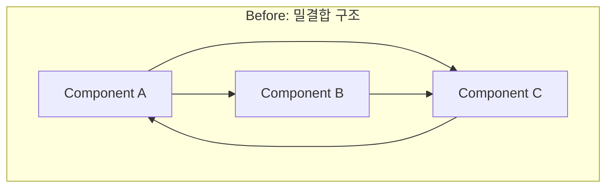
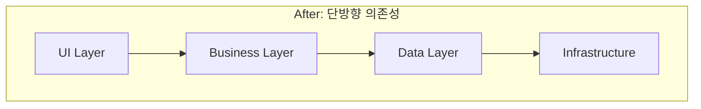

# Code Quality Report

## jikime-adk-v2 코드 품질 비교 보고서

---

## 1. 코드 품질 개요

### 1.1 품질 측정 도구

| 도구 | 용도 | 버전 |
|------|------|------|
| ESLint | 정적 분석 | {{ESLINT_VERSION}} |
| TypeScript | 타입 체크 | {{TS_VERSION}} |
| Prettier | 코드 포매팅 | {{PRETTIER_VERSION}} |
| SonarQube | 종합 품질 분석 | {{SONAR_VERSION}} |

### 1.2 품질 지표 요약

```
코드 품질 지표 비교
────────────────────────────────────────────────────────
                    Before          After           변화
────────────────────────────────────────────────────────
타입 안전성         {{TYPE_BEFORE}}%       {{TYPE_AFTER}}%        ↑{{TYPE_IMPROVEMENT}}%
테스트 커버리지     {{COVERAGE_BEFORE}}%   {{COVERAGE_AFTER}}%    ↑{{COVERAGE_IMPROVEMENT}}%
코드 중복률         {{DUP_BEFORE}}%        {{DUP_AFTER}}%         ↓{{DUP_IMPROVEMENT}}%
복잡도 점수         {{COMPLEXITY_BEFORE}}  {{COMPLEXITY_AFTER}}   ↓{{COMPLEXITY_IMPROVEMENT}}%
기술 부채           {{DEBT_BEFORE}}        {{DEBT_AFTER}}         ↓{{DEBT_IMPROVEMENT}}%
────────────────────────────────────────────────────────
```

---

## 2. 타입 안전성 개선

### 2.1 TypeScript 적용 현황

| 지표 | Before | After | 변화 |
|------|--------|-------|------|
| **TypeScript 파일 비율** | {{TS_RATIO_BEFORE}}% | {{TS_RATIO_AFTER}}% | ↑{{TS_RATIO_IMPROVEMENT}}% |
| **any 타입 사용** | {{ANY_COUNT_BEFORE}}개 | {{ANY_COUNT_AFTER}}개 | ↓{{ANY_IMPROVEMENT}}% |
| **strict mode** | {{STRICT_BEFORE}} | ✅ 활성화 | 완전 적용 |
| **타입 에러** | {{TYPE_ERROR_BEFORE}}개 | {{TYPE_ERROR_AFTER}}개 | ↓{{TYPE_ERROR_IMPROVEMENT}}% |

### 2.2 타입 안전성 상세

```typescript
// Before: JavaScript with implicit any
function getUser(id) {
  return fetch(`/api/users/${id}`).then(r => r.json())
}

// After: TypeScript with full type safety
interface User {
  id: string
  name: string
  email: string
}

async function getUser(id: string): Promise<User> {
  const response = await fetch(`/api/users/${id}`)
  if (!response.ok) throw new Error('User not found')
  return response.json()
}
```

---

## 3. 테스트 커버리지 개선

### 3.1 커버리지 비교

| 유형 | Before | After | 목표 | 상태 |
|------|--------|-------|------|------|
| **Statements** | {{STMT_BEFORE}}% | {{STMT_AFTER}}% | 80% | {{STMT_STATUS}} |
| **Branches** | {{BRANCH_BEFORE}}% | {{BRANCH_AFTER}}% | 75% | {{BRANCH_STATUS}} |
| **Functions** | {{FUNC_BEFORE}}% | {{FUNC_AFTER}}% | 80% | {{FUNC_STATUS}} |
| **Lines** | {{LINE_BEFORE}}% | {{LINE_AFTER}}% | 80% | {{LINE_STATUS}} |

### 3.2 테스트 구성

```
테스트 구성 비교
────────────────────────────────────────────────────────
                    Before          After
────────────────────────────────────────────────────────
단위 테스트         {{UNIT_BEFORE}}개      {{UNIT_AFTER}}개
통합 테스트         {{INT_BEFORE}}개       {{INT_AFTER}}개
E2E 테스트          {{E2E_BEFORE}}개       {{E2E_AFTER}}개
────────────────────────────────────────────────────────
Total               {{TEST_TOTAL_BEFORE}}개 {{TEST_TOTAL_AFTER}}개
테스트 실행 시간    {{TEST_TIME_BEFORE}}   {{TEST_TIME_AFTER}}
────────────────────────────────────────────────────────
```

### 3.3 테스트 피라미드

```mermaid
graph TB
    subgraph "Before"
        B_E2E[E2E: {{E2E_BEFORE}}개]
        B_INT[Integration: {{INT_BEFORE}}개]
        B_UNIT[Unit: {{UNIT_BEFORE}}개]
    end

    subgraph "After"
        A_E2E[E2E: {{E2E_AFTER}}개]
        A_INT[Integration: {{INT_AFTER}}개]
        A_UNIT[Unit: {{UNIT_AFTER}}개]
    end
```

---

## 4. 코드 복잡도 개선

### 4.1 복잡도 지표

| 지표 | Before | After | 권장 | 상태 |
|------|--------|-------|------|------|
| **평균 순환 복잡도** | {{CC_AVG_BEFORE}} | {{CC_AVG_AFTER}} | < 10 | {{CC_AVG_STATUS}} |
| **최대 순환 복잡도** | {{CC_MAX_BEFORE}} | {{CC_MAX_AFTER}} | < 20 | {{CC_MAX_STATUS}} |
| **평균 함수 길이** | {{FUNC_LEN_BEFORE}}줄 | {{FUNC_LEN_AFTER}}줄 | < 50 | {{FUNC_LEN_STATUS}} |
| **평균 파일 길이** | {{FILE_LEN_BEFORE}}줄 | {{FILE_LEN_AFTER}}줄 | < 400 | {{FILE_LEN_STATUS}} |

### 4.2 복잡한 함수 개선 사례

```
복잡도 높은 함수 개선
────────────────────────────────────────────────────────
Before: processUserData()
├── 순환 복잡도: 25
├── 라인 수: 180
└── 중첩 깊이: 6

After: 함수 분리 및 리팩토링
├── validateUserInput()     CC: 3,  Lines: 25
├── transformUserData()     CC: 4,  Lines: 30
├── saveUserToDatabase()    CC: 2,  Lines: 20
└── sendUserNotification()  CC: 3,  Lines: 25

개선: 복잡도 84% 감소, 테스트 용이성 향상
────────────────────────────────────────────────────────
```

---

## 5. 코드 중복 제거

### 5.1 중복 코드 현황

| 지표 | Before | After | 변화 |
|------|--------|-------|------|
| **중복 코드 블록** | {{DUP_BLOCKS_BEFORE}}개 | {{DUP_BLOCKS_AFTER}}개 | ↓{{DUP_BLOCKS_IMPROVEMENT}}% |
| **중복 라인** | {{DUP_LINES_BEFORE}}줄 | {{DUP_LINES_AFTER}}줄 | ↓{{DUP_LINES_IMPROVEMENT}}% |
| **중복률** | {{DUP_RATE_BEFORE}}% | {{DUP_RATE_AFTER}}% | ↓{{DUP_RATE_IMPROVEMENT}}% |

### 5.2 공통 컴포넌트 추출

| 추출된 컴포넌트 | 재사용 횟수 | 절감 라인 |
|---------------|------------|----------|
| {{COMMON_1}} | {{COMMON_1_REUSE}}회 | {{COMMON_1_SAVE}}줄 |
| {{COMMON_2}} | {{COMMON_2_REUSE}}회 | {{COMMON_2_SAVE}}줄 |
| {{COMMON_3}} | {{COMMON_3_REUSE}}회 | {{COMMON_3_SAVE}}줄 |
| {{COMMON_4}} | {{COMMON_4_REUSE}}회 | {{COMMON_4_SAVE}}줄 |

---

## 6. 코드 스타일 일관성

### 6.1 린팅 결과 비교

```
ESLint 결과 비교
────────────────────────────────────────────────────────
                    Before          After
────────────────────────────────────────────────────────
Errors              {{LINT_ERROR_BEFORE}}개        {{LINT_ERROR_AFTER}}개
Warnings            {{LINT_WARN_BEFORE}}개         {{LINT_WARN_AFTER}}개
Fixable             {{LINT_FIX_BEFORE}}개          {{LINT_FIX_AFTER}}개
────────────────────────────────────────────────────────
```

### 6.2 적용된 규칙

| 규칙 세트 | Before | After |
|----------|--------|-------|
| ESLint Recommended | {{ESLINT_REC_BEFORE}} | ✅ |
| TypeScript Strict | {{TS_STRICT_BEFORE}} | ✅ |
| React Hooks | {{REACT_HOOKS_BEFORE}} | ✅ |
| Next.js Rules | ❌ | ✅ |
| Accessibility (jsx-a11y) | {{A11Y_BEFORE}} | ✅ |

---

## 7. 기술 부채 분석

### 7.1 기술 부채 현황

| 카테고리 | Before | After | 변화 |
|----------|--------|-------|------|
| **Code Smells** | {{SMELL_BEFORE}}개 | {{SMELL_AFTER}}개 | ↓{{SMELL_IMPROVEMENT}}% |
| **Bugs** | {{BUG_BEFORE}}개 | {{BUG_AFTER}}개 | ↓{{BUG_IMPROVEMENT}}% |
| **Vulnerabilities** | {{VULN_CODE_BEFORE}}개 | {{VULN_CODE_AFTER}}개 | ↓{{VULN_CODE_IMPROVEMENT}}% |
| **Debt Ratio** | {{DEBT_RATIO_BEFORE}}% | {{DEBT_RATIO_AFTER}}% | ↓{{DEBT_RATIO_IMPROVEMENT}}% |

### 7.2 기술 부채 해결 시간

```
기술 부채 해결 예상 시간
────────────────────────────────────────────────────────
Before: {{DEBT_TIME_BEFORE}}

After:  {{DEBT_TIME_AFTER}}

절감:   {{DEBT_TIME_SAVE}} ({{DEBT_TIME_IMPROVEMENT}}% 감소)
────────────────────────────────────────────────────────
```

---

## 8. 아키텍처 품질

### 8.1 의존성 구조





### 8.2 모듈 응집도/결합도

| 지표 | Before | After | 권장 | 상태 |
|------|--------|-------|------|------|
| **응집도 (Cohesion)** | {{COHESION_BEFORE}} | {{COHESION_AFTER}} | High | {{COHESION_STATUS}} |
| **결합도 (Coupling)** | {{COUPLING_BEFORE}} | {{COUPLING_AFTER}} | Low | {{COUPLING_STATUS}} |
| **순환 의존성** | {{CYCLIC_BEFORE}}개 | {{CYCLIC_AFTER}}개 | 0 | {{CYCLIC_STATUS}} |

---

## 9. 문서화 수준

### 9.1 문서화 현황

| 항목 | Before | After | 상태 |
|------|--------|-------|------|
| **README** | {{README_BEFORE}} | ✅ 완료 | {{README_STATUS}} |
| **API 문서** | {{API_DOC_BEFORE}} | ✅ 완료 | {{API_DOC_STATUS}} |
| **JSDoc 커버리지** | {{JSDOC_BEFORE}}% | {{JSDOC_AFTER}}% | {{JSDOC_STATUS}} |
| **Storybook** | {{STORYBOOK_BEFORE}} | ✅ 완료 | {{STORYBOOK_STATUS}} |

---

## 10. 권장 사항

### 10.1 지속적 품질 관리

- [ ] PR마다 코드 리뷰 필수
- [ ] 커버리지 {{COVERAGE_TARGET}}% 이상 유지
- [ ] 주간 기술 부채 리뷰
- [ ] 월간 의존성 업데이트

### 10.2 추가 개선 기회

- [ ] {{QUALITY_RECOMMENDATION_1}}
- [ ] {{QUALITY_RECOMMENDATION_2}}
- [ ] {{QUALITY_RECOMMENDATION_3}}

---

**Document**: 04_code_quality_report.md (Post-Migration)
**Generated**: {{DATE}}
**Previous**: [← Security Improvement](./03_security_improvement.md)
**Next**: [Architecture Evolution →](./05_architecture_evolution.md)
